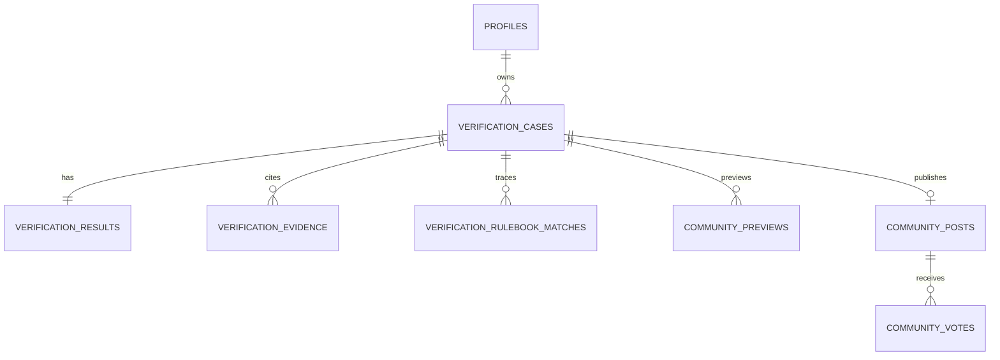
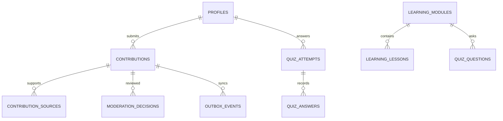

# Database Foundations dan Relasi

[Kembali ke indeks arsitektur database](database-architecture.md)

## 1. Keputusan dasar

- Supabase Auth memiliki akun; PostgreSQL Product memiliki data transaksional; Storage hanya artefak opt-in/private; Product API jalur operasi bisnis.
- Product tidak menyimpan corpus Rulebook, embedding, BM25 index, `rulebook_chunks`, atau `community_chunks`. Tidak perlu extension vector.
- Product **boleh dan perlu** menyimpan snapshot evidence/rule matches, canonical kontribusi sanitized, keputusan moderator, consent, outbox dan version provenance. Memisahkan AI tidak berarti memindahkan semua data komunitas ke AI.
- Koneksi adalah feed kasus, bukan tabel friend request. Six dimensions disimpan kategori, bukan enam skor numerik buatan.
- Migration SQL yang direview adalah sumber kebenaran schema setelah implementasi; kamus ini diperbarui pada PR schema yang sama.
- History policy draft REVIEW_REQUIRED; tabel idempotency/operasi bukan history publik. Hasil tidak eligible tidak berubah menjadi history hanya karena cache retry diperlukan.

## 2. Konvensi

ID internal UUID, default `gen_random_uuid()` bila tersedia pada runtime Supabase yang dipilih. ID AI adalah `text`, karena contoh upstream memakai prefix request/case; jangan memaksa format UUID upstream. API `case_id` Product dipetakan ke UUID `verification_cases.id` dalam draft ini.

Timestamp UTC `timestamptz`. Kolom `created_at` default `now()` not null; `updated_at` trigger pada tabel mutable. Catatan append-only tidak memiliki update rutin. `NN` berarti NOT NULL; `?` berarti nullable. JSONB bukan tempat menyembunyikan password/PII atau menghindari validasi.

Status Product menggunakan `text CHECK (...)` untuk kemudahan evolusi; enum AI mengikuti pinned schema dan divalidasi aplikasi. Enum AI kini dapat mengikuti snapshot unggahan API 0.7.0 yang disertakan; full commit/deployment tetap belum dikonfirmasi. Audit/projection tetap menyimpan `schema_version`.

## 3. Relasi inti

Semua child privat menentukan ownership melalui FK parent, bukan `user_id` client. Outbox aggregate dapat menunjuk contribution atau community case melalui `(aggregate_type, aggregate_id)`; validitas diperiksa service dan transaction, bukan FK polimorfik yang tidak dapat ditegakkan.
