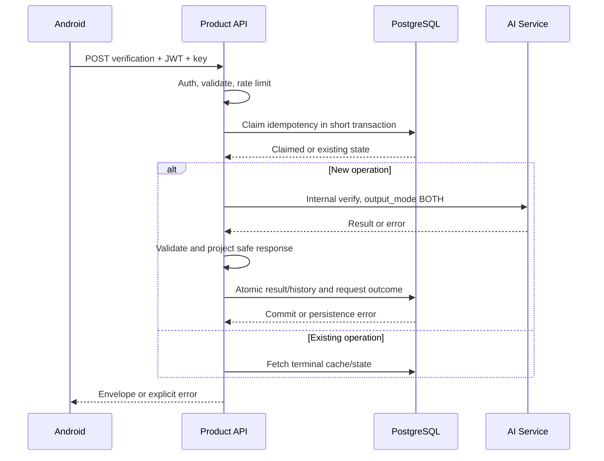

# Runtime, Security, dan Configuration

[Kembali ke indeks arsitektur sistem](system-and-folder-architecture.md)

## 6. Runtime workflow dan failure boundary

Tidak ada transaksi/row lock DB ditahan selama AI berjalan. Idempotency claim memiliki lease/state; lease habis bukan bukti inferensi gagal. Worker/operator harus membedakan UNKNOWN_OUTCOME dari belum dipanggil. Detail replay ada di integrasi.

Community transaksi: validate consent/revision → insert/update canonical records + append decision/audit + outbox → commit. Worker claim event dalam transaksi pendek, commit claim, lalu call AI di luar transaksi; ack/retry terpisah. Worker tidak memegang koneksi terkunci selama network call.

## 7. Security/privasi lintas komponen

| Boundary | Pengendalian |
|---|---|
| Client→Product | TLS, access token validation, owner/role, body limit, rate limit, safe error |
| Product→DB | Role runtime non-superuser/NOBYPASSRLS, JWT context transaction-local, parameterized SQL |
| Product→Storage | Bucket privat, path dibentuk server, MIME/size validation, expiry, short signed URL |
| Product→AI | Internal key, TLS/private network, fixed allowlisted base URL, no user credential forwarding |
| URL evidence→browser | HTTP(S) only, jangan embed arbitrary script, buka sebagai external link aman |
| AI→provider | Ditangani AI engineer: URL/PII sanitasi, guardrail, bounded fan-out |

Service-role Supabase hanya untuk pekerjaan internal tertentu. RLS tidak melindungi query yang dijalankan memakai role yang bypass RLS; karena itu runtime DB role harus dibatasi dan owner check tetap diuji. Health response tidak memaparkan DSN/provider key; `/api/ready` detail hanya operator.

## 8. Configuration dan naming

Nama aktif Product `AI_SERVICE_BASE_URL`, `AI_SERVICE_API_KEY`, `AI_SERVICE_MODE`. Alias lama `WASPADAI_AI_*` pada arsip harus dimigrasikan, bukan dibaca bersamaan dengan precedence samar. Python snake_case; Kotlin PascalCase untuk class dan camelCase untuk property; tabel/kolom snake_case; timestamp UTC `timestamptz`; wire enums uppercase sesuai kontrak.

Semua base URL tanpa suffix `/api/v1`; endpoint path lengkap ditempel adapter. Dengan demikian tidak terjadi `/api/api/v1`. Android config `PRODUCT_API_BASE_URL`; config bukan tempat menyimpan AI URL/key.
