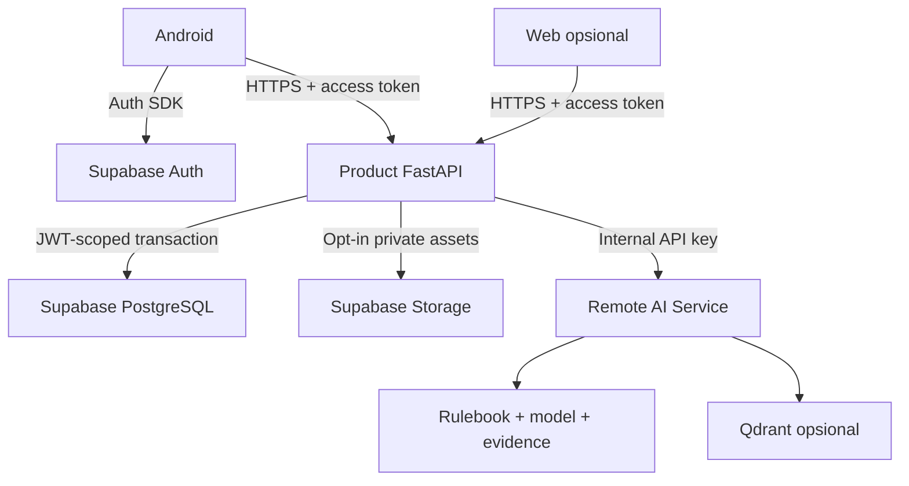

# System Overview dan Struktur Repository

[Kembali ke indeks arsitektur sistem](system-and-folder-architecture.md)

## 1. Topologi dan trust boundary



Android tidak mempercayai state login lokal sebagai authorization server. Product tidak mempercayai request `user_id`/role/score. AI tidak menerima token session. Response AI juga input eksternal: schema, batas ukuran, URL tampilan dan metadata harus divalidasi. Qdrant adalah turunan milik AI, bukan database bisnis.

## 2. Struktur repository Product

Layout berikut telah disesuaikan dengan repository aktual melalui [ADR-0002](../adr/0002-initial-product-baseline.md). `frontend/` adalah Gradle root Android, bukan direktori yang masih membutuhkan lapisan `android/`. Initial setup tidak memerlukan container deployment.

```text
waspadai-products/
|-- frontend/                            # Android Gradle project root
|   |-- app/                             # Android application module
|   |-- gradle/wrapper/
|   |-- gradle/libs.versions.toml
|   |-- gradlew
|   |-- gradlew.bat
|   |-- build.gradle.kts
|   |-- settings.gradle.kts
|   `-- web/                             # Opsional; bukan copy wajib apps/web AI
|-- backend/
|   |-- app/
|   |-- tests/
|   |-- scripts/
|   |-- pyproject.toml
|   `-- uv.lock                         # Satu workflow dependency yang dipin
|-- contracts/
|   `-- documentation-artifact.lock.json # Metadata/hash, bukan salinan kontrak
|-- supabase/
|   |-- config.toml
|   |-- migrations/
|   `-- tests/
|-- scripts/
|   `-- fetch-documentation-artifact.ps1
|-- .github/workflows/ci.yml
|-- package.json                       # Supabase CLI dev dependency
|-- package-lock.json
|-- .env.example
|-- .gitignore
`-- README.md
```

Dokumentasi aktif dan kontrak lengkap tetap berada pada artifact `waspadai-product-docs`, tidak disalin permanen ke repository Product. CI mengambil versi yang dipin ke directory `.artifacts/` yang di-ignore, memverifikasi hash, lalu menjalankan contract tests. Metadata pin yang kecil tetap di Product agar build dapat mengidentifikasi sumber dan versi yang tepat.
