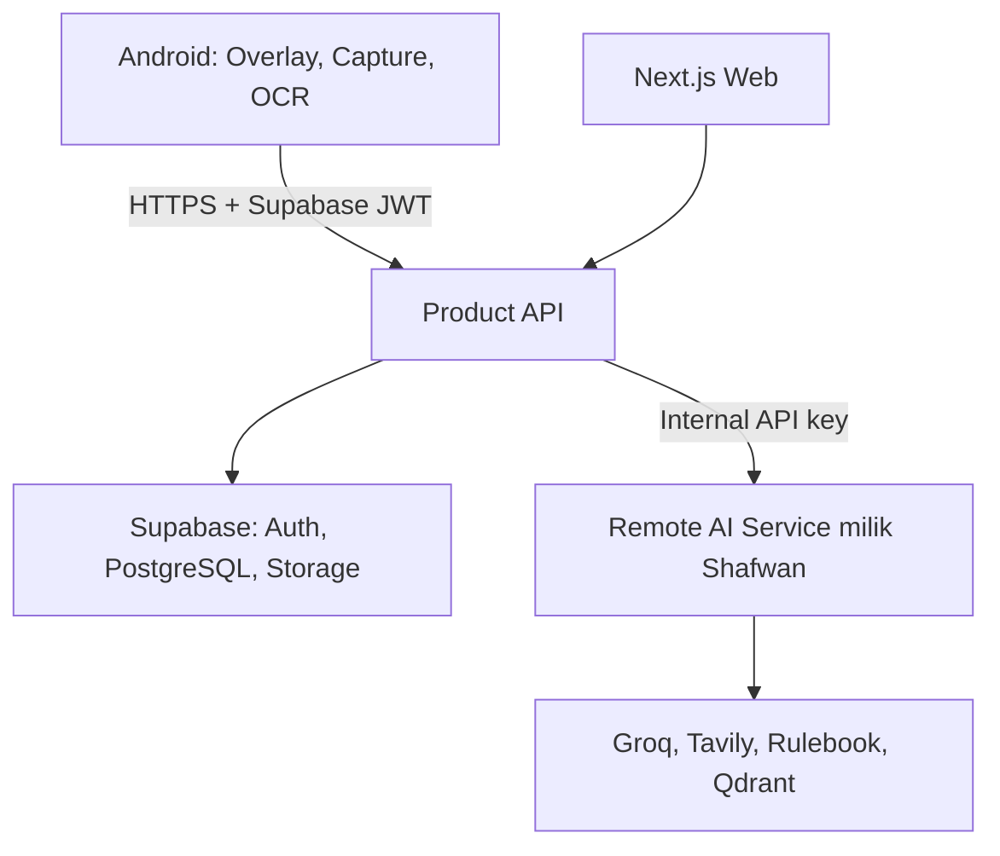
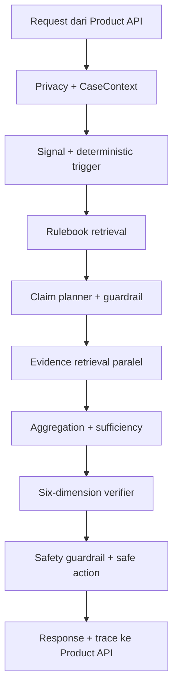
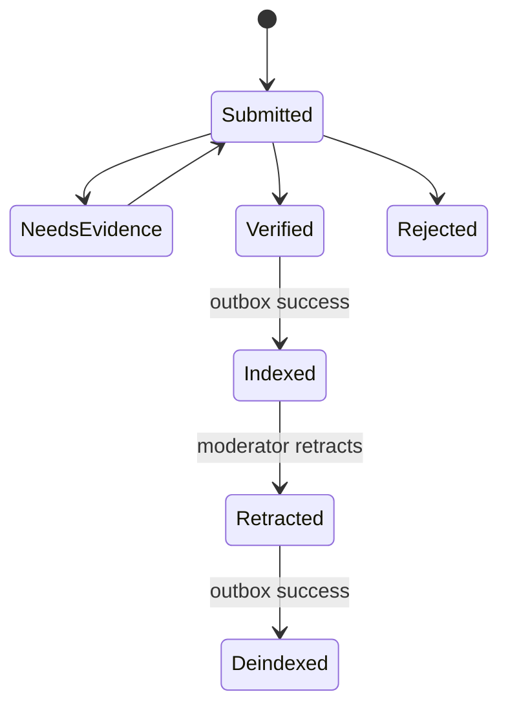
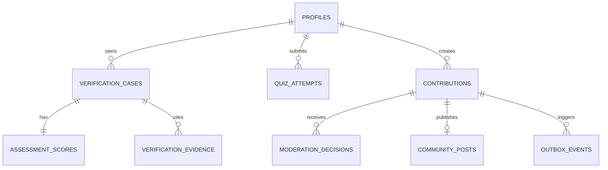

# WaspadAI — Product Requirements Document

Versi: 3.0.1-draft. Tanggal: 15 September 2026. Status: TARGET untuk implementasi Product. Target demo 18 September 2026 berasal dari PRD v2.1; jadwal aktual perlu dikonfirmasi. Batas repo mengikuti [ADR-0001](../adr/0001-product-ai-boundary.md).

## 1. Cara memakai dokumen

Bagian 1–17 merupakan spesifikasi aktif paket ini. Lampiran historis mempertahankan PRD v2.1 **utuh** agar tidak ada rincian sumber hilang; label CURRENT di lampiran berarti laporan pada baseline lama, bukan pemeriksaan saat ini. Implementasi Product belum diaudit. Jangan menandai fitur selesai hanya karena tercantum dalam dokumen.

Keputusan rinci yang belum pernah dipastikan tim ditandai PROPOSED/OPEN. Definisi API, transport dan schema berada di [integrasi](../integration/ai-service.md), bukan disalin menjadi kontrak kedua dalam PRD.

## 2. Ringkasan, masalah, dan nilai produk

WaspadAI adalah asisten keamanan informasi Android berbahasa Indonesia untuk membantu pengguna, dengan fokus awal remaja 13–17 tahun menurut PRD terdahulu, memeriksa pesan, tautan, klaim dan screenshot sebelum bertindak. Produk memberikan dukungan keputusan, bukan jaminan bahwa informasi/pengirim aman.

Masalah: pemeriksaan lintas aplikasi merepotkan; pengguna sering menyamakan kebenaran suatu fakta dengan keamanan tautan, keaslian identitas pengirim, atau keamanan tindakan. Model generatif tanpa bukti dapat memberikan jawaban terlalu pasti. Produk mengurangi friksi pemeriksaan dengan capture yang dimulai pengguna, hasil terstruktur, bukti yang dapat diperiksa dan tindakan aman.

Tiga alur produk:

| Alur | Urutan | Ukuran selesai |
|---|---|---|
| Protection | Login, input/capture, review, verifikasi, hasil, history sesuai policy | Satu kasus nyata dapat diperiksa dan dibuka kembali jika eligible |
| Learning | Hasil, materi terkait, lesson, quiz, progress | Penyelesaian dan skor berasal dari state server |
| Knowledge | Preview sanitized, consent, publikasi, evidence/contribution, moderasi, index | Hanya bukti yang diverifikasi masuk retrieval dan dapat dicabut |

## 3. Persona, peran dan batas akses

| Peran | Kebutuhan | Akses |
|---|---|---|
| Guest | Memahami produk | Informasi onboarding; verifikasi pribadi mengharuskan login |
| User | Cek konten, melihat riwayat, belajar, kontribusi | Hanya data privat miliknya dan feed sanitized yang dipublikasikan |
| Moderator | Menilai bukti, menjaga kualitas komunitas | Antrean kontribusi dan data yang memang diserahkan untuk moderasi; bukan semua screenshot privat |
| Admin/operator | Operasi dan akses terkontrol | Role management, konfigurasi dan audit minimum melalui jalur server |
| AI service | Memproses konten yang diperlukan | Tidak menerima user session, role, refresh token, atau akses database Product |

Role bukan field bebas dari client. Identitas diambil dari token tervalidasi. Data remaja memerlukan perhatian terhadap minimisasi, consent yang jelas, dan peluncuran sesuai kebijakan institusi; paket ini tidak menetapkan kesimpulan kepatuhan hukum.

## 4. Prinsip wajib

1. Capture satu kali hanya setelah tindakan pengguna dan consent sistem; tidak ada pemantauan kontinu, auto-read chat, atau penyadapan notifikasi.
2. Preview/crop sebelum mengirim gambar. Pengguna dapat membatalkan atau mengganti input.
3. Screenshot default tidak disimpan; penyimpanan opsional terpisah dari consent publikasi dan consent RAG.
4. Truth, source, sender, channel, scam risk dan content authenticity tidak dipertukarkan.
5. Bukti tidak cukup boleh menghasilkan UNVERIFIED; jangan mengarang sumber, confidence atau identitas.
6. Rulebook adalah aturan pemeriksaan, bukan evidence atas kebenaran klaim.
7. Indikator OTP/PIN/password/seed phrase/transfer mendesak tidak boleh dilemahkan oleh narasi model.
8. Community vote bukan fact-check dan tidak otomatis mengubah verdict atau kelayakan RAG.
9. Tidak ada key provider/internal/service-role di APK atau bundle web.
10. Gangguan remote ditampilkan sebagai kegagalan yang jujur; mock diberi label SIMULASI, tidak diperlakukan sebagai live.

## 5. Scope bertahap, bukan penghapusan fitur

P0/P1 adalah urutan pengerjaan. Seluruh domain dari PRD lama tetap dicatat. Fitur yang belum siap tidak boleh disamarkan sebagai implementasi lengkap.

| ID | Kapabilitas | Tahap | Detail minimum |
|---|---|---|---|
| F01 | Auth dan profile | P0 | Register/login/logout, refresh terkoordinasi, profile dan role server |
| F02 | Text verification | P0 | Input 10–25.000 karakter, source URL, sender enum, hasil narrative + structured |
| F03 | Image verification | P0 | JPG/PNG/WEBP multipart, preview/crop, batas ukuran/pixel, cleanup |
| F04 | Overlay/capture | P0 | Bubble, move/stop, izin overlay, one-shot MediaProjection dan resource release |
| F05 | OCR lokal | P0 | Preview teks yang dapat dikoreksi; bukan bukti identitas atau field AI otomatis |
| F06 | Enam dimensi/result | P0 | Narrative dahulu, detail dimensi/evidence/safe actions/uncertainty |
| F07 | History | P0 | Penyimpanan bersyarat dalam draft, list/detail/delete owner-only |
| F08 | Pelajari | P1 | 3–5 modul kurasi, tujuan, contoh, checklist dan lesson |
| F09 | Quiz | P1 | 3–5 pertanyaan per modul, jawaban kanonik dan scoring server |
| F10 | Progress | P1 | Lesson selesai, skor terakhir/terbaik, versi modul dan timestamp |
| F11 | Koneksi/community | P1 | Feed/detail sanitized, status jelas, tanpa DM/friend graph |
| F12 | Preview dan consent | P1 | Preview final, kedaluwarsa, consent eksplisit, tidak auto-publish |
| F13 | Voting | P1 | Satu vote/user/kasus, upsert, cancel, owner dilarang vote sendiri |
| F14 | Contribution | P1 | URL bukti, alasan, ringkasan, status dan ownership |
| F15 | Moderation | P1 | Queue, claim/lease, reason, evidence, append-only decisions, retract |
| F16 | Verified Community RAG | P1 dependency-gated | Outbox Product→AI; feature off sampai API indexing diverifikasi |
| F17 | Web pendukung | P1 opsional | Moderation/demo; tidak memindahkan web AI otomatis ke Product |
| F18 | Qdrant dan tuning indeks | P2/AI-owned | Opsional di AI; local BM25+hashed tetap reported baseline |

Non-goals: melatih foundation model, browsing/monitoring layar otomatis, direct messaging, social graph, auto-update canonical Rulebook dari komunitas, mengganti pemeriksa fakta/profesional, atau memindahkan pipeline AI ke Product.

## 6. Taksonomi output dan invariant

Tabel enum di bawah telah dicocokkan dengan AssessmentDimensions pada OpenAPI unggahan API 0.7.0 dan sesuai. Ini verifikasi terhadap file unggahan, bukan terhadap HEAD GitHub/deployment.

| Dimensi | Nilai kategori baseline | Makna |
|---|---|---|
| `factual_status` | SUPPORTED, REFUTED, MISLEADING, PARTLY_TRUE, OUTDATED, UNVERIFIED, SATIRE, OPINION, NOT_APPLICABLE | Dukungan bukti terhadap klaim faktual |
| `source_authenticity` | VERIFIED, UNVERIFIED, SUSPICIOUS, NOT_APPLICABLE | Keaslian sumber yang dirujuk |
| `sender_identity` | VERIFIED, UNVERIFIED, IMPERSONATION_LIKELY, IMPERSONATION_CONFIRMED, NOT_APPLICABLE | Identitas pengirim, tidak sama dengan sumber |
| `channel_status` | VERIFIED, UNVERIFIED, SUSPICIOUS, MALICIOUS, NOT_APPLICABLE | Keamanan/keaslian kanal atau tautan |
| `scam_risk` | CRITICAL, HIGH, MEDIUM, LOW, UNKNOWN | Risiko penipuan/social engineering |
| `content_authenticity` | ORIGINAL, ALTERED, SYNTHETIC, UNVERIFIED, NOT_APPLICABLE | Keaslian artefak; teks polos bukan bukti manipulasi gambar |

Ketentuan:

- `verdict` adalah field upstream yang terpisah dari `dimensions.factual_status`; jangan mengasumsikan enum keduanya identik tanpa kontrak.
- `risk_level` dan `dimensions.scam_risk` ditampilkan sesuai field upstream. Ketidaksesuaian material dicatat untuk validasi, bukan dihitung ulang diam-diam.
- Label UI boleh diterjemahkan, tetapi nilai wire disimpan apa adanya. Nilai baru yang tidak dikenal tidak dipetakan menjadi aman; tampilkan “Status belum dikenali” dan tandai compatibility error.
- Enam dimensi merupakan kategori, **bukan kewajiban enam skor 0–1**. Tidak perlu tabel definisi angka buatan.
- `evidence_sufficiency` 0–1 adalah metrik kecukupan bukti, bukan probabilitas kebenaran. Threshold 0,58 pada PRD lama adalah konfigurasi AI reported; Product tidak menetapkan ulang verdict berdasarkan threshold itu.
- Teks tanpa sumber tidak membuktikan source authenticity. Screenshot bank tidak membuktikan sender identity. Konten benar dapat tetap mengandung tindakan penipuan.
- `requires_human_review` dan `community_status` adalah sinyal upstream; consent/ownership/visibility tetap keputusan Product.
- `recommended_actions` memuat code/title/detail yang aman. Jangan mengaktifkan tautan pembayaran/OTP atau menampilkan arahan penyerahan rahasia.

UI utama memakai `presentation.narrative.text` bila tersedia. Headline menjadi fallback aman jika narasi tidak ada. Detail bertingkat menampilkan `what_checked`, `why`, evidence, sources, dimensi, uncertainty, disclaimer dan safe actions. Raw trace/prompt internal tidak dikirim ke layar pengguna.

## 7. User flows lengkap

### 7.1 Login dan token

User membuka onboarding → register/login Supabase → sesi disimpan menggunakan mekanisme aman platform → profile dan capability Product dimuat → akses fitur. Jika verifikasi email diperlukan, tampilkan pending state dan resend sesuai SDK. Logout membersihkan session, cache privat, input sementara dan menghentikan overlay. Pada 401 Product, refresh terkoordinasi satu kali lalu retry aksi yang sama dengan idempotency key yang sama. Jika masih gagal, minta login; jangan loop.

### 7.2 Verifikasi teks

Input/paste → trim dan validasi → review teks/sumber/konteks → submit → loading → Product auth/input/idempotency → AI internal → schema validation → history policy/persistence → hasil. Batal sebelum kirim tidak memanggil AI. Batal setelah terkirim tidak menjamin komputasi server berhenti; duplicate retry tidak membuat inferensi kedua secara otomatis.

### 7.3 Verifikasi screenshot

Aktifkan overlay → izin overlay → pilih verify → consent MediaProjection yang berlaku untuk target Android → ambil satu frame → release capture resource → preview/crop/redact → OCR lokal untuk review → unggah multipart → tunggu hasil → hapus temp.

Jika izin ditolak: jelaskan cara mengaktifkannya, sediakan input manual/import gambar. Jika frame hitam/secure screen: beri pesan konten tidak dapat ditangkap, jangan mencoba melewati proteksi. Jika OCR kosong: pengguna dapat crop ulang atau lanjut image bila valid. Jika internet hilang: pertahankan input hanya selama layar/sesi aman dan izin pengguna; jangan simpan screenshot ke work queue permanen tanpa consent.

OCR lokal bukan field yang otomatis dapat diteruskan: baseline image AI yang tersedia hanya mendokumentasikan image/question/output_mode. Jangan memasukkan `ocr_text`, `source_url`, atau `sender_context` sebagai multipart field upstream sebelum kontraknya mendukung. Jalur text dari OCR harus menjadi aksi eksplisit tersendiri.

### 7.4 History

**OPEN — proposal draft:** `HISTORY_POLICY=REVIEW_REQUIRED`, mengikuti aturan eksplisit lampiran kontrak: simpan jika `verdict == UNVERIFIED OR requires_human_review == true`. Hasil lain tetap tampil tetapi `history.saved=false`, `case_id=null`, `save_reason=NOT_REQUIRED`.

Keputusan “simpan semua pemeriksaan” pada PRD lama dipertahankan sebagai opsi ALL, bukan diabaikan. Tim harus memilih sebelum freeze; policy tidak boleh berubah per instance. UI menjelaskan history sebagai “Kasus yang perlu ditinjau” saat REVIEW_REQUIRED. Daftar hasil sukses seluruhnya bukan janji baseline draft ini.

History list → detail → evidence/safe action → hapus jika belum VERIFIED_EVIDENCE. Untuk kasus terkunci, tersedia informasi alasan dan proses permintaan pencabutan; lock teknis bukan pengganti kebijakan penghapusan data yang sah. Jika penyimpanan gagal, jangan menyatakan tersimpan; respons memuat SAVE_FAILED dan hasil tetap dapat ditampilkan jika aman. Perilaku retry rinci ada di integrasi.

### 7.5 Community, preview, consent dan voting

Kasus eligible tersimpan PRIVATE → pengguna meminta preview → Product sanitasi ulang dan membuat versi final + expiry → UI menampilkan teks/image final → consent eksplisit → publish `PUBLISHED_UNVERIFIED` → feed berlabel belum diverifikasi → user lain memberi DIDUKUNG/DIBANTAH → moderator menilai evidence.

Preview terikat owner, kasus, content hash, versi redaksi dan expiry. Perubahan konten mengharuskan preview/consent baru. Tidak ada publikasi otomatis karena AI menganggap eligible. Tanpa screenshot tersimpan, preview teks-only valid; jangan membuat janji signed URL gambar yang sudah dihapus.

Vote maksimal satu per user/kasus, dapat diganti/dibatalkan, pemilik tidak boleh vote kasus sendiri, identitas voter tidak dipublikasikan. Aggregat vote tidak mengubah hasil AI atau membuat RAG evidence. Feed PROPOSED membedakan PUBLISHED_UNVERIFIED dan VERIFIED_EVIDENCE; hanya yang kedua dapat ditawarkan sebagai verified knowledge.

### 7.6 Contribution, moderasi dan indexing

User membuat DRAFT berisi URL evidence/ringkasan/alasan → SUBMITTED → moderator claim → NEEDS_EVIDENCE / REJECTED / VERIFIED. NEEDS_EVIDENCE dapat diedit dan disubmit ulang. VERIFIED hanya dengan alasan, sumber, sanitasi dan consent yang sah. Koreksi/verifikasi ulang menambahkan keputusan baru, bukan mengubah log lama.

VERIFIED + allow_rag + consent_rag → outbox UPSERT → AI memvalidasi payload/version → index → acknowledgement. RETRACTED/consent ditarik → segera sembunyikan dari Product feed, naikkan revision, outbox DELETE → AI deindex. Saat indexing tidak tersedia, status jujur PENDING/BLOCKED; jangan mengklaim kontribusi sudah dipakai RAG.

### 7.7 Learning dan progress

User membuka modul published → lesson → complete idempotent → quiz tanpa kunci → submit jawaban → scoring server terhadap versi soal → pembahasan → progress/skor terbaik. Input answer tidak boleh membawa skor/is_correct yang dipercaya server. Perubahan modul tidak merusak audit attempt lama; simpan version snapshot.

## 8. State yang tidak boleh dicampur

| Domain | State draft |
|---|---|
| Request orchestration | PROCESSING, COMPLETED, FAILED, UNKNOWN_OUTCOME |
| AI truth/risk | Nilai dari kontrak AI; bukan state request |
| History save reason | UNVERIFIED, HUMAN_REVIEW, ALL_POLICY, NOT_REQUIRED, SAVE_FAILED |
| Community | PRIVATE, PUBLISHED_UNVERIFIED, VERIFIED_EVIDENCE, WITHDRAWN; NOT_AVAILABLE hanya envelope kasus tak disimpan |
| Contribution | DRAFT, SUBMITTED, NEEDS_EVIDENCE, VERIFIED, REJECTED, RETRACTED |
| Index sync | NOT_REQUESTED, PENDING, SYNCED, FAILED, BLOCKED, DEINDEX_PENDING |
| Preview | READY, CONSUMED, EXPIRED, INVALIDATED |

Transisi diverifikasi di server dalam transaksi dengan pemeriksaan revision. Moderation claim/lease adalah state operasional, bukan keputusan kebenaran baru. Kata `verified` pada status publikasi tidak sama dengan `source_authenticity=VERIFIED`.

## 9. Keamanan dan retensi produk

- Raw screenshot memory-only default. Opt-in private storage maksimal 24 jam; hapus juga derivative yang tidak lagi berizin. Temp dibersihkan pada success/failure/cancel.
- Sanitized history draft retensi 90 hari atau sampai dihapus, perlu ditampilkan di UI. Perubahan retensi harus diterapkan worker dan kebijakan client bersama.
- Idempotency cache default 10 menit setelah operasi terminal; body cache hanya output aman, bukan upload/raw input.
- Preview expiry draft 15 menit; signed URL draft 5 menit dan tidak melebihi expiry asset.
- Audit log tanpa raw PII/secret; draft retensi 90 hari, konfirmasi sesuai kebutuhan event. Private evidence dan moderation berbeda tingkat aksesnya.
- Publikasi dan RAG mempunyai consent terpisah. Withdrawal harus dipropagasikan ke asset, canonical state dan indeks turunan.
- Query URL harus dibatasi SSRF: skema HTTP(S), public destinations, redirect/DNS/IP divalidasi di service yang benar-benar melakukan fetch. Product tidak men-fetch URL hanya untuk menampilkan.
- Tidak ada token, image bytes, full text privat, signed URL, provider secret atau exception mentah di telemetry.

## 10. Non-functional requirements

| Area | Target dan cara verifikasi |
|---|---|
| Latency | Target historis p50 ≤8s/p95 ≤15s; belum hasil benchmark. Catat teks/gambar terpisah. Timeout bukan SLA |
| Timeout | AI deadline 120s, Product 135s, proxy 145s, Android total 150s sebagai PROPOSED; uji hosting mendukung |
| Reliability | Hasil valid/uncertain dibedakan dari transport error; no fake verdict |
| Consistency | Atomic history result/evidence/snapshot; idempotency dan bounded concurrency |
| Authorization | Token valid + role trusted + owner filter + RLS; negative tests dua user |
| Accessibility | Bahasa sederhana, status dengan teks/ikon bukan warna saja, TalkBack, loading dan retry jelas |
| Compatibility | HP final, Android version/permission behavior, orientation/background diuji |
| Operations | Liveness tanpa dependency, readiness terbatas, logs aman, outbox backlog dan expiry worker terpantau |

## 11. Acceptance criteria yang dapat diuji

| ID | Skenario | Expected |
|---|---|---|
| AC-01 | Tanpa token/expired/issuer salah | 401 sebelum AI; 401 bukan alasan melewati login |
| AC-02 | User A mengakses history B | 404 tanpa konfirmasi keberadaan; tidak ada leak evidence/file |
| AC-03 | Role dimanipulasi melalui profile/body | Ditolak; moderator hanya data server |
| AC-04 | Input 9/25.001 karakter | 422; trim dilakukan sebelum panjang dihitung |
| AC-05 | Upload terlalu besar/tipe salah/dimensi invalid | 413/415/422 sebelum inferensi; file header diverifikasi |
| AC-06 | Consent capture ditolak/dicabut | Tidak merekam; resource release; alternatif manual |
| AC-07 | Satu capture selesai | Tidak ada recording yang terus berjalan |
| AC-08 | Text dan image success | Narasi, enam kategori, evidence, safe action dan disclaimer terbaca |
| AC-09 | Bukti kosong/tidak cukup | Tidak otomatis SAFE/SUPPORTED; uncertainty tampil |
| AC-10 | Raw OCR image tidak didukung upstream | Tidak dikirim sebagai field buatan; review OCR tetap berfungsi |
| AC-11 | Key sama, payload sama | Tidak memulai inferensi kedua; replay/processing response sesuai state |
| AC-12 | Key sama, payload berbeda | 409 IDEMPOTENCY_CONFLICT |
| AC-13 | Timeout setelah bytes terkirim | UNKNOWN_OUTCOME; tidak auto-retry inferensi |
| AC-14 | History REVIEW_REQUIRED | Hanya UNVERIFIED/review tersimpan; UI/envelope konsisten |
| AC-15 | Persistence gagal | SAVE_FAILED, case_id null, tanpa klaim saved; retry persistence-only bila cached result ada |
| AC-16 | Preview expired/konten berubah | 409; publikasi tidak terjadi |
| AC-17 | Tidak memberi consent | Tetap privat, tidak index |
| AC-18 | Vote berulang/ganti/batal | Maksimal satu vote, agregat akurat; owner 403 |
| AC-19 | Banyak vote mendukung | Tidak otomatis VERIFIED_EVIDENCE |
| AC-20 | User biasa melakukan moderasi | 403 |
| AC-21 | Dua moderator membuat keputusan pada revision sama | Satu sukses, satu 409; audit tetap utuh |
| AC-22 | Contribution dicabut | Feed tersembunyi segera; deindex dipantau; tidak claim selesai sebelum acknowledgement |
| AC-23 | Quiz sebelum submit | Tidak ada answer_key/is_correct; setelah submit skor server dan explanation |
| AC-24 | Lesson complete dua kali | Satu completion; progress tidak bertambah ganda |
| AC-25 | Restart/offline/logout | Tidak memunculkan data privat user sebelumnya |
| AC-26 | Production dimulai dalam mock | Startup gagal atau deployment gate menolak |
| AC-27 | Cleanup asset 24 jam | Object dan akses derivative hilang; database status konsisten |
| AC-28 | AI response malformed/unknown critical enum | 502; tidak disimpan sebagai hasil live valid |

## 12. Golden cases

| ID | Input sintetis | Invariant pengujian |
|---|---|---|
| G01 | Pesan bank meminta OTP/PIN segera | Tidak memberi tindakan bagikan OTP; risiko tidak direndahkan; exact enum dikonfirmasi AI |
| G02 | Akun menyerupai instansi + kanal mencurigakan | Tidak menyatakan sender VERIFIED hanya karena nama/logo |
| G03 | Klaim yang dibantah sumber primer fixture | Evidence penyangkal dan provenance tetap ditampilkan; tidak mengarang URL live |
| G04 | Klaim tanpa bukti memadai | UNVERIFIED, uncertainty, history eligible bila policy REVIEW_REQUIRED |
| G05 | Fakta benar tetapi ajakan transfer berisiko | Truth dan scam risk tidak disamakan |
| G06 | AI 429/timeout/malformed response | Error yang jujur, no silent mock, retry aman |
| G07 | Publikasi hasil berisi nomor/email sintetis | Preview akhir sanitized; identity tidak ada di feed |
| G08 | Evidence verified kemudian dicabut | Revision/tombstone mencegah event UPSERT lama menghidupkan kembali index |

Fixtures sintetis untuk test integrasi bukan evidence keberhasilan live. Expected exact AI output harus dibekukan bersama AI engineer pada kontrak dan model/rule version yang sama.

## 13. Implementation status awal

| Area | Status paket | Bukti sebelum boleh DONE |
|---|---|---|
| Keputusan batas repo | DECIDED | ADR dan dependency checks |
| 7 dokumen | AUTHORED | Link/struktur/consistency checks |
| Product contract | DRAFT | Review OPEN + export parity + client test |
| Upstream AI snapshot | UPLOADED SCHEMA VERIFIED | File unggahan dan SHA-256 tersedia; full commit serta smoke staging belum dikonfirmasi |
| Android/Product API/database | TARGET | Source, build, tests, migration dan E2E |
| AI kemampuan/61 test lama | REPORTED BASELINE | Hasil test baru dari AI engineer, bukan angka arsip |
| Community indexing | OPEN | Endpoint/schema/retract capability dikonfirmasi |

Tambahkan kolom owner, branch/PR, tanggal, blocker dan evidence saat coding dimulai. Jangan mengganti TARGET menjadi CURRENT hanya karena folder dibuat.

## 14. Eksekusi dan pembagian kerja

Milestone A: kontrak/ADR/policy → scaffold → identity/RLS → text end-to-end. Milestone B: image/capture → result/history → golden cases. Milestone C: learning/quiz/progress → consent/community/vote → contribution/moderation. Milestone D: indexing bila dependency siap → deployment → rehearsal/video/PPT.

Jadwal 15–18 September pada arsip merupakan rencana historis, bukan janji waktu yang diverifikasi. Owner AI: Shafwan. Owner Product/Supabase/release: PM/Technical. Designer: flow, states, assets dan materi presentasi. Gunakan satu blocker utama per anggota; pisahkan perubahan kontrak dari polish UI.

## 15. Risiko dan mitigasi

| Risiko | Mitigasi |
|---|---|
| Scope luas | Urutan vertical slice; tetap catat fitur deferred dan label status demo |
| Drift kontrak | Full pin/checksum + contract diff + fixture + review bersama |
| AI unavailable | Health, timeout, error state; mock hanya eksplisit, video cadangan |
| Data pribadi tersimpan | Memory-only, redaksi, consent/expiry dan cleanup tests |
| Community poisoning | Provenance, moderator, consent, verified-only RAG dan retract |
| Retry biaya ganda | Local idempotency tidak dianggap idempotency AI; unknown outcome tidak auto-resubmit |
| Pool DB habis | Pool bounded, transaksi pendek, tidak menunggu AI dalam transaksi |
| Permission OEM berbeda | Uji HP demo sejak awal, fallback input manual |

## 16. Definition of Done

Rilis Product selesai bila login/capture/text/image/result berjalan di HP final; history sesuai policy; learning/quiz/progress tersimpan; community/consent/vote/moderation bekerja; semua privacy/RLS/error tests lulus; OpenAPI upstream benar-benar dipin; deployment reproducible tanpa source AI; mock/debug tidak aktif di production; rehearsal dua kali dan video/build cadangan tersedia. Klaim Verified Community RAG hanya boleh masuk demo jika round-trip indexing/retrieval/retract benar-benar telah diuji.

## 17. Coverage sumber dan change control

Tidak ada detail sumber sengaja dihapus: folder lama utuh ada di dokumen arsitektur, database lama utuh di database, kontrak Android lama utuh di integrasi, dan PRD v2.1 utuh di bawah. Bagian aktif mengganti konflik dengan keputusan eksplisit; lampiran menjaga rumus BM25, hashed-subword, parameter planner, Qdrant payload, daftar modul dan seluruh catatan lama untuk audit.

Perubahan taxonomy, history policy, community visibility, endpoint, request fields, retention, model/rule baseline atau indexing harus mencatat owner/alasan/diff/schema migration/test/rollback. Kontrak Product dan migration aktif diperbarui bersama, bukan menyalin SQL/enum lama dari arsip.

## Penyesuaian kontrak unggahan 0.7.0

Request text mendukung page_context opsional untuk konteks kutipan; question opsional tetapi tidak menerima null. Default output_mode AI STRUCTURED, sehingga Product wajib meminta BOTH. Seluruh 26 field VerificationResponse wajib; nullable tetap wajib hadir jika tercantum required. verdict memiliki delapan nilai tanpa NOT_APPLICABLE, sedangkan factual_status dapat NOT_APPLICABLE. Evidence verification_status mencakup REVIEWED. mode AI konstan LIVE; simulasi ditandai execution_mode=MOCK pada envelope Product, termasuk history/detail komunitas. UI memakai penanda Product tersebut untuk badge SIMULASI. Schema ketat tidak berarti setiap klaim AI benar atau deployment sudah diuji.

## Lampiran historis utuh — prd-integrated-technical.md v2.1

**NON-NORMATIVE / ARSIP.** Isi berikut dipertahankan tanpa pemangkasan untuk audit detail sumber. Ini bukan spesifikasi aktif. Arsitektur monorepo AI, endpoint direct, status CURRENT, enum, nama tabel, resep SQL, metode vote, policy history/retensi dan perintah setup di dalamnya dapat bertentangan dengan keputusan terbaru; gunakan bagian aktif dokumen dan ADR. Jangan menjalankan perintah arsip atau mengklaim angka benchmark/test sebagai hasil pemeriksaan saat ini.

<details>
<summary>Buka seluruh isi sumber terdahulu</summary>

~~~~text
# WaspadAI — Product Requirements Document Terintegrasi

**Versi:** 2.1  
**Status:** Baseline implementasi hackathon  
**Tanggal baseline:** 15 September 2026  
**Target demo produk:** 18 September 2026  
**Pemilik dokumen:** Product Manager WaspadAI  
**Baseline AI:** repository `ShafwanAdhi/waspadAI-demo`, commit `a84ad57`  
**Platform utama:** Android; web dipertahankan sebagai demo, dokumentasi, dan permukaan pendukung
**Model integrasi AI:** service terpisah melalui HTTP API; repository AI tidak menjadi dependency instalasi aplikasi

---

## 1. Tujuan Dokumen

Dokumen ini adalah sumber acuan terpadu untuk produk, desain, Android, backend, AI, data, pengujian, dan deployment WaspadAI. Isinya menggabungkan:

1. ruang lingkup proposal APTIKOM 2026;
2. PRD dan dokumen teknis tim yang telah disusun;
3. implementasi AI terbaru milik Shafwan;
4. keputusan penggunaan Supabase untuk Auth, PostgreSQL, dan Storage;
5. rancangan Qdrant untuk pertumbuhan Rulebook dan Verified Community RAG.

Dokumen menggunakan tiga label agar rencana tidak tertukar dengan kondisi repository:

| Label | Arti |
|---|---|
| **CURRENT** | Sudah terdapat dan dapat ditelusuri pada baseline repository Shafwan. |
| **PARTIAL** | Sebagian alur sudah tersedia, tetapi belum memenuhi kebutuhan produk end-to-end. |
| **TARGET MVP** | Wajib tersedia sebagai irisan tipis namun fungsional untuk demo hackathon. |

Jika terdapat konflik, urutan sumber kebenaran adalah: kontrak API yang dibekukan untuk rilis, keputusan arsitektur yang disetujui tim, dokumen ini, lalu dokumentasi turunan.

---

## 2. Ringkasan Produk

WaspadAI adalah asisten keamanan informasi Android berbahasa Indonesia yang membantu pengguna—terutama remaja usia 13–17 tahun—memeriksa tangkapan layar, pesan, tautan, dan klaim digital sebelum mengambil tindakan berisiko.

Produk tidak hanya memberi label benar atau salah. Setiap pemeriksaan memisahkan empat keluaran:

1. **Truth Status** — sejauh mana klaim faktual didukung bukti;
2. **Risk Status** — risiko penipuan atau social engineering;
3. **Evidence** — sumber dan potongan bukti yang dapat diperiksa pengguna;
4. **Safe Action** — tindakan paling aman yang dapat dilakukan berikutnya.

WaspadAI memiliki tiga loop utama:

- **Protection:** overlay → capture → verifikasi → safe action → history.
- **Learning:** hasil pemeriksaan → materi Pelajari → quiz → progress.
- **Knowledge:** kontribusi komunitas → moderasi → Verified Community RAG → pemeriksaan berikutnya.

### 2.1 Batas repository

WaspadAI menggunakan dua repository dan dua lifecycle deployment yang berbeda:

| Repository | Pemilik | Isi | Cara digunakan aplikasi |
|---|---|---|---|
| **WaspadAI App/Product** | Tim produk | Android, web, Product API, Supabase migration, learning, history, contribution, moderation | Repository utama yang di-clone dan dijalankan tim aplikasi. |
| **WaspadAI AI Service** (`ShafwanAdhi/waspadAI-demo`) | AI Engineer/Shafwan | OCR backend, Vision, Rulebook, BM25, hashed-subword, evidence retrieval, planner, six-dimension verifier, Qdrant adapter | Dideploy terpisah; Product API hanya memanggil internal HTTP API. |

Developer Android/Product **tidak perlu meng-clone, menginstal dependency, atau menjalankan repository `waspadAI-demo`**. Untuk pengembangan normal, cukup tersedia `WASPADAI_AI_BASE_URL` dan `WASPADAI_AI_API_KEY`. Pada unit/integration test, panggilan tersebut diganti mock/stub berdasarkan kontrak OpenAPI.

### 2.2 Pernyataan masalah

Pengguna menerima informasi berisiko di chat, media sosial, atau browser, tetapi proses memindahkan konten ke alat pemeriksa sering terlalu lambat. Jawaban AI generik juga dapat menyamakan kebenaran faktual, identitas pengirim, keaslian konten, dan risiko tindakan. WaspadAI mengurangi friksi pemeriksaan sekaligus menjaga hasil tetap terstruktur, dapat ditelusuri, dan berorientasi keselamatan.

### 2.3 Sasaran

- Memungkinkan pemeriksaan yang dimulai pengguna dari layar ponsel tanpa pemantauan kontinu.
- Memberi hasil enam dimensi yang konsisten dan mudah dipahami.
- Menyertakan bukti aktual serta provenance, bukan hanya opini model.
- Menyimpan riwayat aman agar pengguna dapat meninjau keputusan sebelumnya.
- Mengubah kasus menjadi pengalaman belajar singkat.
- Menggunakan kontribusi komunitas hanya setelah moderasi dan sanitasi.

### 2.4 Non-goals MVP

- Pemantauan layar atau notifikasi secara kontinu.
- Membaca chat secara otomatis tanpa aksi eksplisit pengguna.
- Direct message atau jejaring sosial penuh di Koneksi.
- Mengganti lembaga pemeriksa fakta, aparat, atau penasihat profesional.
- Menjadikan output LLM sebagai sumber kebenaran tunggal.
- Memperbarui Rulebook deterministik secara otomatis dari kontribusi komunitas.
- Melatih model fondasi baru.

---

## 3. Pengguna dan Peran

| Peran | Kebutuhan utama | Hak minimum |
|---|---|---|
| Guest | Memahami nilai produk | Melihat landing/demo publik; tidak memiliki history pribadi. |
| User | Memeriksa konten dan belajar | Verifikasi, history milik sendiri, Pelajari, quiz, progress, Koneksi terverifikasi, kontribusi. |
| Moderator | Menjaga kualitas komunitas | Semua hak User, antrean moderasi, keputusan terhadap kontribusi. |
| Admin/Operator | Menjaga sistem | Operasi indeks, reindex, audit, konfigurasi dan observability terbatas. |
| Internal service | Integrasi server-to-server | Endpoint internal dengan `X-Waspadai-API-Key`; tidak mewakili pengguna akhir. |

Role moderator/admin wajib dibaca dari data server yang dipercaya. Role tidak boleh diambil dari body request atau metadata yang dapat diubah pengguna.

---

## 4. Prinsip Produk, AI, dan Keamanan

1. **User initiated.** MediaProjection hanya berjalan setelah consent Android dan tindakan eksplisit.
2. **Data minimization.** Screenshot mentah tidak disimpan secara default.
3. **Privacy before reasoning.** URL disanitasi dan PII direduksi sebelum masuk model, pencarian, log, atau indeks komunitas.
4. **Rulebook is policy, evidence is proof.** Rulebook mengatur cara pemeriksaan; ia bukan bukti eksternal atas suatu klaim.
5. **Truth, risk, source, sender, channel, dan content authenticity berbeda.** Satu dimensi tidak boleh dipakai untuk menyimpulkan seluruh dimensi lain.
6. **Uncertainty is valid.** Bukti yang tidak cukup menghasilkan `UNVERIFIED`, bukan tebakan.
7. **Deterministic safety wins.** Indikator kritis seperti permintaan OTP, PIN, atau transfer mendesak tidak boleh diturunkan risikonya oleh narasi LLM.
8. **Community is untrusted until verified.** Hanya data berstatus `VERIFIED`, telah disanitasi, tidak dicabut, dan memiliki consent yang boleh masuk retrieval.
9. **No secrets on client.** Kunci Groq, Tavily, Supabase service role, database, dan Qdrant tidak boleh berada di APK.
10. **Graceful degradation.** Gangguan web search, Qdrant, atau model harus menghasilkan fallback aman, bukan halaman kosong.

---

## 5. Ruang Lingkup MVP dan Status Baseline

Semua fitur berikut tetap bagian MVP. Untuk tenggat hackathon, kedalamannya dapat tipis, tetapi alur utamanya harus nyata dan dapat didemokan.

| Kapabilitas | Status baseline Shafwan | Target MVP 18 September |
|---|---|---|
| Authentication | Belum ada | Register/login/logout/session melalui Supabase Auth; JWT divalidasi FastAPI. |
| Android overlay | Belum ada | Bubble dapat tampil, dipindah, ditekan, dan dihentikan. |
| MediaProjection | Belum ada | Consent sistem, satu kali capture, cleanup token/resource. |
| OCR | CURRENT/PARTIAL | OCR lokal Tesseract di AI Service sudah opsional; Android menambah ML Kit OCR Bahasa Indonesia. |
| Vision | CURRENT | Qwen Vision memproses screenshot sebagai konteks multimodal. |
| Rulebook retrieval | CURRENT | Deterministic trigger + BM25 + hashed-subword + metadata + phase quota. |
| Evidence retrieval | PARTIAL | Tavily dan evidence lokal resmi sudah ada; tambah persistensi, provenance, dan community adapter. |
| Six-dimension assessment | CURRENT | Enam dimensi terstruktur dipertahankan sebagai kontrak. |
| History | Belum ada | Hasil pemeriksaan disimpan backend ke Supabase dan hanya dapat dibaca pemilik. |
| Pelajari | Belum ada | 3–5 modul kurasi dengan lesson detail. |
| Quiz | Belum ada | 3–5 pertanyaan kanonik per modul dan feedback hasil. |
| Progress | Belum ada | Penyelesaian materi, skor terbaik, dan ringkasan kemajuan. |
| Koneksi | Belum ada | Feed/detail kasus terverifikasi dan sudah disanitasi; tanpa DM. |
| Contribution | Belum ada | User mengirim URL bukti dan alasan; status dapat ditelusuri. |
| Moderation | Belum ada | Moderator dapat meminta bukti, memverifikasi, menolak, atau mencabut. |
| Verified Community RAG | PARTIAL | Adapter evidence lokal tersedia; tambah indeks dari kontribusi `VERIFIED` saja. |
| Web demo | CURRENT/PARTIAL | Home, Chat, About tersedia; dipertahankan sebagai alat demo. |

### 5.1 Prioritas demonstrasi

Urutan skenario utama:

1. User login di Android.
2. User membuka overlay dan memberi izin MediaProjection.
3. User mengambil satu screenshot pesan mencurigakan.
4. ML Kit OCR menghasilkan teks; screenshot dan teks dikirim melalui HTTPS.
5. Backend menampilkan hasil enam dimensi, evidence, safe action, dan uncertainty.
6. Hasil muncul pada History.
7. User membuka materi terkait, mengerjakan quiz, dan progress berubah.
8. Moderator memverifikasi satu contribution; kasus sanitized muncul di Koneksi dan dapat diretrieval sebagai community evidence.

---

## 6. Kebutuhan Fungsional dan Acceptance Criteria

### 6.1 Authentication

**FR-AUTH-01.** Android menggunakan Supabase SDK untuk register/login.  
**FR-AUTH-02.** Android menyimpan session menggunakan mekanisme secure storage platform, bukan plain text.  
**FR-AUTH-03.** Setiap endpoint user FastAPI menerima `Authorization: Bearer <access_token>`.  
**FR-AUTH-04.** FastAPI memvalidasi signature, issuer, audience, expiry, dan `sub`.  
**FR-AUTH-05.** `sub` dipetakan ke `profiles.id`; role efektif dibaca dari database.  
**FR-AUTH-06.** Logout membersihkan session lokal dan refresh token sesuai kemampuan SDK.

Acceptance:

- **AC-AUTH-01:** request tanpa token atau token kedaluwarsa ditolak `401` dengan envelope error konsisten.
- **AC-AUTH-02:** User tidak dapat membaca history, progress, atau contribution user lain.

### 6.2 Overlay dan MediaProjection

**FR-CAP-01.** Overlay hanya berjalan setelah izin `SYSTEM_ALERT_WINDOW`.  
**FR-CAP-02.** Bubble dapat dipindahkan dan memiliki aksi verify/stop.  
**FR-CAP-03.** MediaProjection meminta consent sistem pada setiap session yang diwajibkan Android.  
**FR-CAP-04.** Capture berupa satu frame atas inisiasi pengguna; tidak ada continuous recording.  
**FR-CAP-05.** ImageReader, VirtualDisplay, dan MediaProjection callback dibersihkan setelah selesai/gagal.  
**FR-CAP-06.** UI memperlihatkan status capturing, extracting, verifying, success, dan failure.

Acceptance:

- **AC-VER-01:** satu tap dapat menghasilkan screenshot valid atau pesan penolakan izin yang dapat ditindaklanjuti.
- **AC-VER-02:** aplikasi tidak merekam setelah proses capture selesai.
- **AC-VER-03:** kegagalan jaringan dapat dicoba ulang tanpa mengambil screenshot baru selama data masih ada di memori.

### 6.3 OCR dan Vision

**FR-INP-01.** Android menjalankan ML Kit OCR terlebih dahulu agar pengguna dapat melihat dan mengoreksi teks.  
**FR-INP-02.** Product API menerima file image lalu meneruskannya ke AI Service untuk Vision dan fallback OCR.  
**FR-INP-03.** `ocr_text`, `source_url`, konteks pengirim, dan image diperlakukan sebagai input yang dapat berbeda.  
**FR-INP-04.** File lebih dari 8 MB ditolak sebelum inference.  
**FR-INP-05.** Image dinormalisasi dan metadata berlebih tidak diteruskan ke model.

### 6.4 Verification dan enam dimensi

Setiap hasil wajib memuat:

| Dimensi | Enum |
|---|---|
| `factual_status` | `SUPPORTED`, `REFUTED`, `MISLEADING`, `PARTLY_TRUE`, `OUTDATED`, `UNVERIFIED`, `SATIRE`, `OPINION`, `NOT_APPLICABLE` |
| `source_authenticity` | `VERIFIED`, `UNVERIFIED`, `SUSPICIOUS`, `NOT_APPLICABLE` |
| `sender_identity` | `VERIFIED`, `UNVERIFIED`, `IMPERSONATION_LIKELY`, `IMPERSONATION_CONFIRMED`, `NOT_APPLICABLE` |
| `channel_status` | `VERIFIED`, `UNVERIFIED`, `SUSPICIOUS`, `MALICIOUS`, `NOT_APPLICABLE` |
| `scam_risk` | `CRITICAL`, `HIGH`, `MEDIUM`, `LOW`, `UNKNOWN` |
| `content_authenticity` | `ORIGINAL`, `ALTERED`, `SYNTHETIC`, `UNVERIFIED`, `NOT_APPLICABLE` |

Aturan invariant:

- Teks tanpa `source_url` mempertahankan `source_authenticity=UNVERIFIED`.
- Teks polos menggunakan `content_authenticity=NOT_APPLICABLE` kecuali ada artefak lain.
- Risiko OTP/PIN/password/seed phrase atau transfer mendesak tidak boleh dilemahkan oleh jawaban model.
- Evidence tidak cukup menghasilkan `UNVERIFIED` dan `requires_human_review=true` bila relevan.

Acceptance:

- **AC-AI-01:** response selalu valid terhadap schema enam dimensi.
- **AC-AI-02:** evidence memiliki URL, publisher, waktu retrieval, stance, dan status verifikasi.
- **AC-AI-03:** rule match dan evidence tidak tercampur sebagai satu jenis objek.
- **AC-AI-04:** output gagal aman bila provider tidak tersedia.
- **AC-AI-05:** empat golden cases menghasilkan label keselamatan yang telah disepakati.

### 6.5 History

**FR-HIS-01.** Backend menyimpan ringkasan input yang telah disanitasi, hasil, evidence, rule matches, model/prompt/rulebook version, dan trace ID.  
**FR-HIS-02.** Screenshot mentah tidak disimpan default. Jika demo memerlukan opt-in storage, harus ada consent, expiry, dan bucket privat.  
**FR-HIS-03.** User dapat melihat list/detail dan menghapus history miliknya.

- **AC-HIS-01:** hasil yang sukses muncul di History setelah response diterima dan tidak dapat dibaca oleh user lain.

### 6.6 Pelajari, Quiz, dan Progress

**FR-LRN-01.** Pelajari menyediakan minimal 3 modul: phishing/OTP, impersonation, dan misinformasi.  
**FR-LRN-02.** Setiap modul memiliki tujuan, lesson singkat, contoh, checklist, dan quiz.  
**FR-LRN-03.** Pertanyaan dan jawaban kanonik berasal dari database, bukan dibuat bebas saat attempt.  
**FR-LRN-04.** Model hanya boleh membantu variasi skenario setelah melalui validasi konten.  
**FR-LRN-05.** Progress memuat lesson selesai, attempt, skor terakhir, skor terbaik, dan waktu pembaruan.

- **AC-LEARN-01:** penyelesaian lesson tersimpan dan idempotent.
- **AC-LEARN-02:** submit quiz mengembalikan skor dan pembahasan tanpa mengekspos kunci jawaban sebelum submit.

### 6.7 Koneksi dan Contribution

**FR-COM-01.** Koneksi adalah feed kasus terverifikasi yang telah disanitasi, bukan ruang percakapan langsung.  
**FR-COM-02.** Feed tidak menampilkan nomor telepon, email, alamat, token, atau identitas korban.  
**FR-COM-03.** User dapat membuat contribution berisi URL evidence, ringkasan, alasan, dan referensi kasus opsional.  
**FR-COM-04.** Status contribution: `DRAFT`, `SUBMITTED`, `NEEDS_EVIDENCE`, `VERIFIED`, `REJECTED`, `RETRACTED`.  
**FR-COM-05.** User hanya dapat mengubah contribution saat `DRAFT` atau `NEEDS_EVIDENCE`.

- **AC-COM-01:** hanya post `VERIFIED` yang muncul di feed publik-authenticated.
- **AC-COM-02:** submission yang mengandung PII diblokir atau disanitasi sebelum moderasi.

### 6.8 Moderation dan Verified Community RAG

**FR-MOD-01.** Moderator melihat antrean berdasarkan status dan usia submission.  
**FR-MOD-02.** Keputusan wajib memiliki alasan dan tercatat immutable pada audit log.  
**FR-MOD-03.** `VERIFIED` memicu outbox indexing; `RETRACTED` memicu deindex.  
**FR-MOD-04.** Kegagalan indexing tidak menggagalkan keputusan database; worker dapat retry.  
**FR-RAG-01.** Retrieval komunitas wajib memfilter `status=VERIFIED`, `consent=true`, `retracted_at=null`, dan waktu berlaku.  
**FR-RAG-02.** Community evidence membawa ID contribution, moderator decision, `verified_at`, dan content hash.  
**FR-RAG-03.** Community evidence tidak boleh mengubah deterministic trigger atau canonical Rulebook otomatis.

- **AC-MOD-01:** user biasa mendapat `403` pada endpoint moderator.
- **AC-RAG-01:** contribution yang dicabut tidak muncul pada retrieval berikutnya setelah outbox selesai.

---

## 7. Arsitektur Sistem



### 7.1 Tanggung jawab komponen

| Komponen | Tanggung jawab | Larangan |
|---|---|---|
| Android | Consent, capture, OCR, input review, hasil, history, learning, community | Tidak menyimpan provider/service-role key. |
| Next.js | Demo web dan permukaan pendukung | Tidak mengakses database dengan service role dari browser. |
| Product API (FastAPI) | AuthZ user, validasi produk, proxy/orchestration, persistence, learning, moderation, audit | Tidak menjalankan model, Rulebook, atau mengimpor modul repository AI. |
| Remote AI Service | OCR backend, Vision, Rulebook, planner, evidence retrieval, six-dimension assessment | Tidak mengelola session Android, profil, history, atau role user produk. |
| Supabase Auth | Identitas dan lifecycle token | Tidak menjadi pengganti authorization domain. |
| PostgreSQL | Sumber kebenaran transaksional | Tidak menyimpan screenshot mentah secara default. |
| Storage | Artefak opt-in/private | Bucket publik untuk bukti pribadi dilarang. |
| Rulebook files pada AI repo | Sumber kebenaran aturan | Tidak disalin ke repository aplikasi. |
| Qdrant pada AI service | Indeks retrieval turunan | Tidak diakses langsung oleh Android/Product API. |
| Groq models | Vision, planning, verification, explanation | Tidak memutuskan hak akses atau override guardrail kritis. |
| Tavily | Web evidence aktual | Query tidak boleh memuat PII yang tidak diperlukan. |

### 7.2 Pola Product API dan remote AI service

Product API tetap modular monolith untuk mengejar tenggat. Batas domain Auth, Verification, Learning, Community, dan Moderation dipisah di kode. AI Service adalah deployment terpisah dengan kontrak HTTP yang terversi. Pemisahan ini mencegah dependency model, OCR, dan Rulebook masuk ke setup Android maupun Product API.

Alur verifikasi:

1. Android mengirim request dan Supabase JWT ke Product API.
2. Product API memvalidasi JWT, ownership, ukuran input, dan idempotency.
3. Product API meneruskan payload ke internal endpoint AI Service memakai `X-Waspadai-API-Key`.
4. AI Service menjalankan pipeline Shafwan dan mengembalikan `VerificationResponse`.
5. Product API memvalidasi response terhadap schema, menambahkan `verification_id`, lalu menyimpan History ke Supabase.
6. Product API mengembalikan hasil ke Android.

Android tidak memanggil AI Service langsung agar kunci internal tidak bocor di APK dan persistence tetap konsisten.

---

## 8. Arsitektur Folder Target

Struktur berikut hanya untuk repository **WaspadAI App/Product**. Repository AI milik Shafwan tidak ditempatkan sebagai submodule, subtree, folder vendor, maupun dependency Python.

```text
waspadai-product/
├── frontend/
│   ├── android/
│   │   ├── app/src/main/java/id/waspadai/
│   │   │   ├── core/
│   │   │   │   ├── auth/
│   │   │   │   ├── network/
│   │   │   │   ├── database/
│   │   │   │   ├── designsystem/
│   │   │   │   └── privacy/
│   │   │   ├── feature/
│   │   │   │   ├── auth/
│   │   │   │   ├── overlay/
│   │   │   │   ├── capture/
│   │   │   │   ├── verification/
│   │   │   │   ├── history/
│   │   │   │   ├── learning/
│   │   │   │   ├── connection/
│   │   │   │   └── contribution/
│   │   │   ├── navigation/
│   │   │   └── MainActivity.kt
│   │   └── app/src/{test,androidTest}/
│   └── web/
│       ├── src/app/
│       ├── src/components/
│       ├── src/lib/api/
│       └── public/
├── backend/
│   ├── app/
│   │   ├── main.py
│   │   ├── config.py
│   │   ├── api/
│   │   ├── schemas/
│   │   ├── domains/
│   │   ├── services/
│   │   ├── repositories/
│   │   ├── clients/
│   │   ├── workers/
│   │   └── observability/
│   ├── tests/
│   ├── Dockerfile
│   └── requirements.txt
├── contracts/
│   ├── product-api.openapi.json
│   ├── ai-service.openapi.json
│   └── ai-service/
│       ├── verification-request.schema.json
│       └── verification-response.schema.json
├── supabase/
│   ├── migrations/
│   ├── seed.sql
│   └── tests/
├── infrastructure/
│   ├── nginx/
│   ├── docker/
│   └── scripts/
├── docs/
├── compose.yaml
└── .env.example
```

### 8.1 Struktur modul Python Product API

```text
backend/app/
├── main.py                         # app factory, lifespan, router, health
├── config.py                       # pydantic-settings; fail-fast secrets
├── api/
│   ├── dependencies/
│   │   ├── auth.py                 # Bearer + Supabase JWT validation
│   │   ├── roles.py                # require_user/moderator/admin
│   │   ├── database.py             # scoped DB session
│   │   ├── idempotency.py
│   │   └── request_context.py      # request_id, trace_id
│   ├── v1/routes/
│   │   ├── me.py
│   │   ├── verification.py
│   │   ├── history.py
│   │   ├── learning.py
│   │   ├── community.py
│   │   ├── contributions.py
│   │   └── moderation.py
│   └── internal/routes/
│       └── callbacks.py
├── schemas/
│   ├── common.py
│   ├── verification.py
│   ├── assessment.py
│   ├── evidence.py
│   ├── learning.py
│   ├── community.py
│   └── moderation.py
├── domains/
│   ├── verification/models.py
│   ├── learning/models.py
│   └── community/models.py
├── services/
│   ├── verification_service.py     # JWT → AI API → schema check → persistence
│   ├── history_service.py
│   ├── learning_service.py
│   └── moderation_service.py
├── repositories/
│   ├── verification_repository.py
│   ├── learning_repository.py
│   ├── contribution_repository.py
│   ├── moderation_repository.py
│   └── outbox_repository.py
├── clients/
│   ├── supabase_auth.py
│   ├── postgres.py
│   └── waspadai_ai.py              # typed async HTTP client; no AI SDK
├── workers/
│   └── community_sync_worker.py    # push verified/retracted item ke AI API
└── observability/
    ├── logging.py
    ├── metrics.py
    └── tracing.py
```

Ketentuan integrasi versi Shafwan:

- Seluruh file AI `CURRENT` tetap berada di repository dan deployment Shafwan.
- Product repository tidak meng-copy `pipeline.py`, `rag.py`, Rulebook, Tesseract, Groq SDK, Tavily client, atau Qdrant client.
- Integrasi dilakukan oleh `clients/waspadai_ai.py` berdasarkan `contracts/ai-service.openapi.json`.
- Product API memiliki mock/stub AI untuk test dan pengembangan offline.
- Perubahan response AI harus backward compatible atau menaikkan versi kontrak.
- OpenAPI Product API menjadi input code generation Kotlin/TypeScript; OpenAPI AI Service hanya digunakan server-to-server.

### 8.2 Setup developer tanpa repository AI

Setup lokal Product repository hanya membutuhkan Python/Product API, Android Studio, Node bila web digunakan, dan akses Supabase. Developer mengisi:

```dotenv
WASPADAI_AI_BASE_URL=https://<host-ai-yang-sudah-dideploy>
WASPADAI_AI_API_KEY=<key-yang-diberikan-ai-engineer>
```

Tidak ada langkah `git clone ShafwanAdhi/waspadAI-demo`, instalasi Tesseract, download Rulebook, instalasi Groq SDK, atau menjalankan Qdrant. Bila remote AI belum dapat diakses, gunakan `AI_SERVICE_MODE=mock` dengan fixture response yang lolos schema.

---

## 9. Kontrak CaseContext dan VerificationResult

### 9.1 CaseContext internal

`CaseContext` adalah kontrak internal AI Service. Product API tidak mengimplementasikan pembentukannya; Product API hanya meneruskan input yang telah divalidasi dan menyimpan output akhir. Baseline Shafwan sudah memiliki `CaseContext`; field identitas/persistence berikut berada pada envelope Product API dan tidak perlu diteruskan seluruhnya ke AI Service:

```json
{
  "request_id": "uuid",
  "user_id": "uuid",
  "input_type": "TEXT|IMAGE",
  "sanitized_text": "string",
  "sanitized_urls": ["https://example.org/path"],
  "sender_context": "optional string",
  "ocr_source": "ANDROID_ML_KIT|BACKEND_TESSERACT|NONE",
  "image_available_to_vision": true,
  "signals": {},
  "privacy_actions": ["PHONE_REDACTED"],
  "created_at": "RFC3339"
}
```

Redaksi definitif sebelum Groq/Tavily tetap menjadi tanggung jawab AI Service. Product API menerapkan validasi awal dan tidak menyimpan image. Image hanya hidup selama request kecuali user memberi consent eksplisit terhadap penyimpanan.

### 9.2 VerificationResult

Response baseline Shafwan dipertahankan agar UI tidak kehilangan informasi:

- `request_id`, `trace_id`, `status`, `mode`, `mode_notice`;
- `input_summary`;
- `verdict`, `risk_level`, dan `dimensions`;
- `headline`, `what_checked`, `why`;
- `evidence_sufficiency` dan `evidence_sufficiency_label`;
- `evidence[]`, `sources[]`;
- `recommended_actions[]`;
- `uncertainty`, `requires_human_review`;
- `community_status`, `privacy_notice`;
- rulebook trace dan pipeline stages;
- `disclaimer`.

Product API memvalidasi response AI, lalu menambahkan `verification_id` dan `history_saved` tanpa menghapus `request_id`/`trace_id`.

### 9.3 Evidence item

```json
{
  "id": "string",
  "claim_id": "string",
  "source_type": "OFFICIAL|FACT_CHECK|WEB|COMMUNITY_VERIFIED",
  "publisher": "string",
  "title": "string",
  "url": "https://...",
  "published_at": "RFC3339|null",
  "retrieved_at": "RFC3339",
  "excerpt": "string",
  "relevance": 0.0,
  "authority": 0.0,
  "recency": 0.0,
  "stance": "SUPPORTS|REFUTES|CONTEXT|UNKNOWN",
  "verification_status": "VERIFIED|UNVERIFIED",
  "provenance": {
    "adapter": "tavily|local_official|community_qdrant",
    "content_hash": "sha256"
  }
}
```

---

## 10. Pipeline AI Terintegrasi

Seluruh proses pada bagian ini berjalan di **remote AI Service milik Shafwan**, bukan di repository Product. Rinciannya dipertahankan dalam PRD agar kontrak dan kualitas hasil dapat diaudit, tetapi developer aplikasi cukup memanggil API.



### 10.1 Jalur image — CURRENT

1. Validasi tipe dan ukuran maksimum 8 MB.
2. Normalisasi image dan OCR lokal opsional menggunakan Tesseract `ind+eng`.
3. Sanitasi URL dan redaksi PII.
4. Qwen Vision memahami konteks screenshot.
5. Hasil digabung ke privacy-filtered CaseContext.

Android menambahkan OCR ML Kit sebelum upload, tetapi AI Service tidak mempercayai teks client secara mutlak; Vision dan validasi AI Service tetap dipakai.

### 10.2 Jalur text — CURRENT

1. Panjang minimum 10 dan maksimum 25.000 karakter.
2. Normalisasi, inferensi tipe konten, dan sender context.
3. Maksimum 10 case URL, disanitasi sebelum downstream.
4. Redaksi PII dan pembuatan CaseContext.

### 10.3 Shared pipeline — CURRENT/PARTIAL

1. Ekstraksi sinyal deterministik.
2. Retrieval Rulebook lokal.
3. Claim planner `openai/gpt-oss-20b`, maksimum 8 claim.
4. Validasi/repair plan secara lokal.
5. Reviewer `openai/gpt-oss-120b` hanya bila feature flag dan budget mengizinkan; default mati.
6. `asyncio.gather` menjalankan Tavily, official evidence lokal, dan community adapter secara paralel.
7. Evidence di-deduplikasi dan dihitung kecukupannya; threshold baseline `0.58`.
8. Post-retrieval deterministic guardrail.
9. Qwen `qwen/qwen3.6-27b` menghasilkan assessment dan penjelasan.
10. Enforcement keputusan scam/safety dan fallback aman.

Konfigurasi batas baseline:

| Parameter | Nilai |
|---|---:|
| Planned claims | 8 |
| Planner case chars | 6.000 |
| Planner rules | 6 |
| Rule content per planner item | 240 chars |
| Evidence per verifier | 6 |
| Evidence excerpt | 650 chars |
| Web queries | 3 |
| Results per query | 3 |
| Web excerpt | 800 chars |
| Evidence sufficiency | 0,58 |

---

## 11. Rulebook Retrieval: BM25, Hashed-Subword, dan Metadata

Bagian ini mendeskripsikan perilaku aktual `apps/api/app/services/rag.py` **di repository AI Service Shafwan** dan harus dianggap baseline sampai ada evaluasi yang membuktikan perubahan lebih baik. File tersebut tidak dipindahkan atau diinstal pada Product repository.

### 11.1 Corpus

- 255 semantic chunks;
- 18 source records;
- 17 deterministic triggers;
- canonical corpus: `RB-INF-001@1.0.0`, `RB-ATO-001@1.2.0`, `RB-GOV-001@1.2.0`.

Searchable text adalah gabungan `title`, `content`, `domain`, `chunk_type`, `trigger_description`, `agent_action`, dan `caveat`.

### 11.2 Tokenisasi dan query expansion

- Regex token: `\b[\w.-]+\b` dengan dukungan Unicode.
- Token di-`casefold`, karakter `.`/`-` di tepi dibuang, token panjang ≤1 dan stopword lokal dibuang.
- Query diperluas dengan `domains`, `attack_patterns`, `channels`, `requested_actions`, `requested_secrets`, dan istilah yang berasal dari boolean signals.

### 11.3 BM25

Baseline menggunakan `k1=1.5` dan `b=0.75`.

$$
\operatorname{IDF}(q)=\log\left(1+\frac{N-df(q)+0.5}{df(q)+0.5}\right)
$$

$$
\operatorname{BM25}(D,Q)=\sum_{q\in Q}\operatorname{IDF}(q)\cdot
\frac{tf(q,D)(k_1+1)}{tf(q,D)+k_1\left(1-b+b\frac{|D|}{avgdl}\right)}
$$

Nilai BM25 dinormalisasi pada kandidat sebelum fusion.

### 11.4 Hashed-subword

Hashed-subword adalah representasi lokal deterministik, bukan learned embedding dan tidak memanggil API eksternal.

Algoritma baseline:

1. Buat fitur unigram token.
2. Tambahkan bigram token bersebelahan dengan bentuk `left_right`.
3. Untuk setiap token yang dipadding menjadi `^token$`, buat character trigram.
4. Hash setiap fitur dengan BLAKE2b `digest_size=8`.
5. `bucket = first_4_bytes mod 384`.
6. Bit pada byte kelima menentukan tanda `+1` atau `-1`.
7. Akumulasikan signed count pada vektor 384 dimensi.
8. Lakukan normalisasi L2.
9. Similarity adalah cosine query terhadap chunk.

Manfaatnya adalah toleransi terhadap variasi ejaan dan frasa dengan biaya rendah. Keterbatasannya: collision hash dan ketiadaan pemahaman semantik learned; karena itu ia tidak boleh disebut dense embedding model.

### 11.5 Metadata dan skor akhir

$$
score=0.50\,BM25_{norm}+0.27\,\max(0,cos_{subword})+0.19\,metadata+severityBoost
$$

Dengan:

$$
metadata=\min(1,0.16\times matchedSignalCount+0.35\times domainMatch)
$$

- `severityBoost=0.04` untuk rule `CRITICAL` ketika signal cocok.
- Match type subword dicatat bila cosine ≥ `0.12`.
- Minimum score default `0.12`.
- Maksimum kandidat 30 dan hasil akhir 12.

### 11.6 Deterministic trigger dan phase quota

Rule yang dipaksa deterministic selalu ditempatkan terlebih dahulu. Kandidat lain dipilih menggunakan quota:

| Phase | Quota |
|---|---:|
| Detection | 3 |
| Investigation | 5 |
| Decision | 2 |
| Response | 2 |

Fallback safe rules digunakan ketika tidak ada kandidat cukup kuat. Cache LRU default 128 memakai key SHA-256 dari query, signals, phases, dan corpus hash; corpus hash disingkat 16 hex.

### 11.7 Quality gate perubahan retrieval

Bobot, threshold, tokenizer, atau embedding baru hanya boleh dirilis jika:

- Recall@K rule relevan tidak turun pada golden set;
- semua deterministic critical trigger tetap recall 100%;
- P95 tidak melanggar SLO;
- error case ejaan Bahasa Indonesia membaik;
- hasil dapat diulang pada corpus version yang sama.

---

## 12. Evidence Retrieval dan Aggregation

### 12.1 Adapter sumber

| Adapter | Baseline | Kebijakan |
|---|---|---|
| Official local store | CURRENT | Daftar resmi terkurasi; selalu membawa domain/provenance. |
| Tavily web search | CURRENT | Maksimum 3 query × 3 result; PII tidak masuk query. |
| Fact-check source | TARGET/PARTIAL | Prioritaskan publisher pemeriksa fakta dengan metadata tanggal. |
| Reputation source | TARGET | Untuk domain/URL/nomor; hasil tidak otomatis membuktikan klaim faktual. |
| Verified community | PARTIAL/TARGET | Hanya kontribusi verified, sanitized, consented, active. |

### 12.2 Aggregation

- Deduplikasi berdasarkan URL canonical, content hash, dan source ID.
- Skor menggabungkan relevance, authority, recency, source type, dan stance coverage.
- Maksimum 6 evidence diberikan ke verifier.
- Bukti yang mendukung dan membantah harus dipertahankan bila relevan.
- Nilai sufficiency di bawah 0,58 menghasilkan bahasa ketidakpastian.
- `retrieved_at` selalu direkam; `published_at` boleh null tetapi tidak boleh direka.

### 12.3 Connection reuse

- Ketentuan pada subsection ini berlaku di deployment AI Service dan menjadi tanggung jawab AI Engineer.
- `AsyncGroq` dibuat sekali selama lifespan AI Service.
- `httpx.AsyncClient` untuk Tavily harus dipindahkan dari pembuatan per-search menjadi singleton lifespan dengan connection pool.
- Terapkan connect/read/write/pool timeout eksplisit dan bounded retry dengan jitter hanya untuk error transient.
- Jangan retry otomatis request mutasi tanpa idempotency key.
- Semua adapter menggunakan semaphore/rate limiter untuk mencegah fan-out tak terbatas.

---

## 13. Strategi Qdrant

### 13.1 Posisi arsitektural

Qdrant berada di sisi **AI Service** dan merupakan derived retrieval index, bukan sumber kebenaran. PostgreSQL Product dan file canonical Rulebook di repository AI tetap sumber utama. Product repository tidak memasang Qdrant SDK dan tidak memegang `QDRANT_API_KEY`. Untuk corpus Rulebook saat ini yang hanya 255 chunk, local BM25 + hashed-subword cukup dan lebih aman bagi deadline.

Feature flag berikut dikonfigurasi pada deployment AI Service, bukan `.env` Product:

```dotenv
RULEBOOK_RETRIEVAL_BACKEND=local
COMMUNITY_RETRIEVAL_BACKEND=postgres
QDRANT_ENABLED=false
```

Mode target:

- `local`: baseline penuh Shafwan.
- `hybrid_qdrant`: Qdrant menambah candidate generation; deterministic trigger, metadata, phase quota, `RuleMatch`, dan guardrail tetap berlaku.
- Gangguan Qdrant selalu fallback ke local retrieval.

### 13.2 Collection strategy

Untuk MVP gunakan satu collection `waspadai_knowledge_v1` dengan payload filter ketat berdasarkan `object_kind`. Ini mengurangi overhead operasional. Collection terpisah baru diperlukan jika isolasi, embedding dimension, atau kebijakan retensi berbeda secara material.

Konfigurasi minimum:

- distance: `Cosine`;
- vector size: harus sama dengan output model embedding yang dipilih, tidak di-hardcode sebelum model dibekukan;
- payload indexes: `object_kind`, `status`, `domain`, `phase`, `severity`, `language`, `consent`, `version`, `retracted_at`;
- point ID deterministik dari `object_kind + canonical_id + version + chunk_id`;
- `content_hash` SHA-256 untuk idempotency dan deteksi drift.

Payload:

```json
{
  "object_kind": "RULEBOOK|OFFICIAL_EVIDENCE|COMMUNITY_VERIFIED",
  "canonical_id": "RB-ATO-001",
  "chunk_id": "uuid-or-stable-slug",
  "domain": "ATO",
  "phase": "DETECTION",
  "severity": "CRITICAL",
  "language": "id",
  "status": "VERIFIED",
  "version": "1.2.0",
  "source_ids": ["uuid"],
  "consent": true,
  "verified_at": "RFC3339|null",
  "retracted_at": null,
  "content_hash": "sha256"
}
```

### 13.3 Retrieval Qdrant

Filter wajib dibangun server-side, bukan dari filter bebas client.

| Use case | Filter wajib |
|---|---|
| Rulebook | `object_kind=RULEBOOK`, version aktif, domain/phase sesuai |
| Official evidence | `object_kind=OFFICIAL_EVIDENCE`, `status=VERIFIED`, tidak expired |
| Community RAG | `object_kind=COMMUNITY_VERIFIED`, `status=VERIFIED`, `consent=true`, `retracted_at=null` |

Qdrant dapat menyimpan named dense/sparse vectors dan mendukung hybrid queries. Namun pada rilis hackathon, Qdrant tidak boleh diam-diam mengganti formula ranking lokal. Kandidat Qdrant digabung dan di-rerank melalui kontrak fusion yang terversi. Dense score hanya masuk bobot produksi setelah benchmark offline.

### 13.4 Indexing lifecycle



Transaksi moderasi pada Product API memasukkan perubahan status dan `outbox_events` dalam transaksi PostgreSQL yang sama. Product worker:

1. mengunci batch event dengan `FOR UPDATE SKIP LOCKED`;
2. mengambil record canonical;
3. memastikan status/consent/PII policy valid;
4. memanggil endpoint indexing internal AI Service secara idempotent;
5. menandai event selesai atau menjadwalkan retry;
6. pada retract, memanggil endpoint deindex internal AI Service.

AI Service membuat embedding, melakukan upsert/delete, dan memiliki `AsyncQdrantClient` singleton. Terapkan timeout, bounded retry, circuit breaker, health metric, dan fallback. Variabel baseline lama `QDRANT_COLLECTION=factcheck_knowledge` dapat dibaca sementara pada AI deployment, tetapi nama target harus eksplisit dan terversi.

---

## 14. Arsitektur Data Supabase/PostgreSQL

### 14.1 Sumber kebenaran dan kepemilikan write

- Supabase Auth memiliki identitas.
- PostgreSQL memiliki state produk.
- Product API FastAPI adalah jalur write utama untuk verification history, learning, contribution, moderation, dan outbox sinkronisasi.
- Android dapat memakai Supabase Auth secara langsung, tetapi tidak menulis tabel sensitif langsung.
- Service role hanya berada di backend.
- RLS tetap diwajibkan sebagai defense in depth.



### 14.2 Tabel inti

Semua tabel memakai UUID, `created_at timestamptz`, dan `updated_at timestamptz` bila dapat berubah.

| Tabel | Kolom penting | Catatan |
|---|---|---|
| `profiles` | `id` FK `auth.users`, `display_name`, `role`, `locale` | Role default `USER`. |
| `verification_cases` | `id`, `user_id`, `request_id`, `trace_id`, `input_type`, `sanitized_text`, `input_hash`, `status`, `result_json`, versions | Unique `(user_id, request_id)` untuk idempotency. |
| `assessment_scores` | `verification_id`, enam dimensi, `evidence_sufficiency`, `requires_human_review` | Satu record per verification. |
| `verification_evidence` | `verification_id`, `evidence_id`, source metadata, URL, score, stance, provenance | Snapshot evidence saat keputusan. |
| `verification_rulebook_matches` | `verification_id`, `rule_id`, `rule_version`, score components, match type, phase | Audit retrieval. |
| `learning_modules` | `id`, `slug`, `title`, `status`, `order_no`, `version` | Konten canonical terkurasi. |
| `learning_lessons` | `id`, `module_id`, `title`, `body_md`, `order_no` | Markdown yang disanitasi saat render. |
| `quiz_questions` | `id`, `module_id`, prompt, options JSON, answer, explanation, version | Answer tidak dikirim sebelum submit. |
| `lesson_progress` | `user_id`, `lesson_id`, `completed_at` | Unique user/lesson. |
| `quiz_attempts` | `id`, `user_id`, `module_id`, answers, score, version | Server melakukan scoring. |
| `contributions` | `id`, `user_id`, URL, summary, reasoning, sanitized content, status, consent, hashes | State machine moderasi. |
| `moderation_decisions` | `id`, `contribution_id`, `moderator_id`, action, reason, snapshot | Append-only. |
| `community_posts` | `id`, `contribution_id`, sanitized title/body, published/retracted timestamps | Hanya derived dari verified contribution. |
| `outbox_events` | `id`, aggregate, type, payload, attempts, available/processed time, last_error | Sinkronisasi Qdrant yang recoverable. |
| `audit_logs` | actor, action, resource, request/trace ID, metadata | Tidak memuat secret atau raw PII. |

### 14.3 RLS minimum

| Tabel | User | Moderator/Admin | Service role/backend |
|---|---|---|---|
| `profiles` | Select/update profil sendiri terbatas | Read sesuai kebutuhan | Full sesuai service policy |
| `verification_*` | Select/delete milik sendiri | Tidak default membaca konten pribadi | Write/read untuk request terautentikasi |
| `learning_*` | Select published | Manage via trusted backend | Full |
| `lesson_progress`, `quiz_attempts` | Select milik sendiri | Agregat tanpa PII | Full |
| `contributions` | CRUD state yang diizinkan milik sendiri | Read queue/update via backend | Full |
| `moderation_decisions` | Read keputusan terkait kontribusi sendiri yang aman | Insert/read | Full |
| `community_posts` | Select active verified | Manage via backend | Full |
| `outbox_events`, `audit_logs` | Tidak ada direct access | Tidak ada direct client access | Full |

### 14.4 Retensi

- Screenshot mentah: default tidak disimpan; opt-in demo maksimal 24 jam pada bucket privat.
- Sanitized verification history: default 90 hari untuk MVP atau sampai user menghapus; kebijakan final harus tampil di UI.
- Audit moderasi: minimal selama periode kompetisi dan evaluasi, dengan akses terbatas.
- Qdrant point: selama canonical record verified dan active; retract harus mendeindex.
- Log aplikasi: jangan merekam Authorization header, raw screenshot, API key, atau teks pribadi penuh.

---

## 15. Strategi Koneksi

### 15.1 Android → Supabase Auth

1. Android login/register melalui SDK Supabase.
2. SDK mengelola access/refresh token pada secure storage.
3. Network interceptor menambahkan access token ke request FastAPI.
4. Pada `401` karena expiry, lakukan satu refresh terkoordinasi lalu retry sekali.
5. Jangan melakukan refresh paralel untuk setiap request; gunakan mutex/single-flight.
6. TLS certificate validation tidak boleh dimatikan.

### 15.2 FastAPI → validasi token

Pilihan MVP tercepat: panggil Supabase Auth `get_user(token)` dengan client server dan cache singkat hanya untuk metadata non-sensitif. Pilihan target lebih efisien: validasi JWT lokal memakai JWKS dengan cache dan refresh saat `kid` tidak ditemukan.

Validasi wajib:

- algoritma sesuai JWKS, bukan nilai dari client;
- signature;
- `iss` project Supabase;
- `aud` yang disepakati;
- `exp`/`nbf` dengan skew kecil;
- `sub` berupa UUID user;
- user tidak disabled/deleted sesuai kebutuhan risk.

### 15.3 FastAPI → PostgreSQL Supabase

Gunakan URL persis dari menu **Connect** project Supabase; jangan menyusun hostname sendiri.

| Runtime | Mode koneksi |
|---|---|
| Backend container persisten dengan IPv6 atau IPv4 add-on | Direct connection. |
| Backend container persisten tetapi jaringan IPv4-only | Shared pooler **session mode**. |
| Serverless/edge/autoscaling sangat pendek | Transaction pooler. |
| Migration, `pg_dump`, backup | Direct connection. |

Persyaratan:

- `sslmode=require` atau SSL equivalent driver;
- pool aplikasi kecil dan bounded; mulai 5 koneksi + overflow 5, ukur sebelum menaikkan;
- connection pre-ping dan recycle;
- statement timeout untuk query aplikasi;
- transaction mode mengharuskan prepared statement dimatikan; untuk `asyncpg`, `statement_cache_size=0`;
- satu transaksi untuk case + assessment + evidence + rule matches;
- jangan menahan transaksi database saat menunggu Groq/Tavily.

Urutan persistence verification:

1. jalankan inference tanpa transaksi DB panjang;
2. buka transaksi singkat;
3. insert `verification_cases` dengan unique idempotency key;
4. insert assessment/evidence/rule match;
5. commit;
6. return hasil. Jika persistence gagal, response harus menandai `history_saved=false` dan dapat retry idempotent.

### 15.4 Product API → remote AI Service

Product API memakai satu `httpx.AsyncClient` pada lifespan aplikasi dengan base URL dari `WASPADAI_AI_BASE_URL` dan header `X-Waspadai-API-Key`. Nilai praktis awal:

- connect timeout 5 detik;
- write timeout 30 detik untuk upload image;
- read timeout 120 detik karena inference dapat memerlukan waktu;
- pool timeout 5 detik;
- maksimum koneksi disesuaikan concurrency demo, diawali 10;
- retry maksimal 1 kali hanya untuk connect/reset sebelum response dan hanya bila request memakai idempotency key;
- circuit breaker membuka sementara setelah kegagalan berulang.

Product API tidak meneruskan Supabase JWT, role, email, atau user ID ke AI Service. AI menerima integration key, request/trace ID, dan konten minimum yang dibutuhkan. `X-Request-ID` dipakai untuk korelasi log tanpa membuka identitas pengguna.

Product API wajib memvalidasi status HTTP dan body AI terhadap schema. Response invalid menghasilkan `502 AI_INVALID_RESPONSE`; timeout menghasilkan `504 AI_TIMEOUT`. Jika AI tidak tersedia, History tidak boleh menyimpan hasil palsu. UI menerima error retryable yang jelas.

Untuk unit test dan kerja tanpa internet, `AI_SERVICE_MODE=mock` memakai fixture contract. Mock tidak boleh aktif pada production.

### 15.5 AI Service → provider eksternal

Bagian ini dijalankan pada repository/deployment Shafwan; Product repository tidak menginstal client berikut.

| Provider | Client pada AI Service | Timeout/retry | Fallback |
|---|---|---|---|
| Groq | Satu `AsyncGroq` lifespan | Bounded timeout, rate limiter, retry transient | Deterministic/local response aman. |
| Tavily | Satu `httpx.AsyncClient` lifespan | Connect/read/pool timeout, max retry rendah | Official/local/community evidence. |
| Qdrant | Satu `AsyncQdrantClient` lifespan | Timeout + circuit breaker | BM25 + hashed-subword lokal. |

### 15.6 Internal server-to-server

Endpoint AI `/api/internal/*` mempertahankan header `X-Waspadai-API-Key`. AI deployment menyimpan daftar key pada `WASPADAI_API_KEYS`; Product deployment hanya menyimpan satu key aktif pada `WASPADAI_AI_API_KEY`. Nilai tersebut **bukan** OpenAI/Groq key dan **bukan** Supabase JWT. Perbandingan di AI Service menggunakan constant-time compare. Rotasi dilakukan dengan menambahkan key baru di AI Service, memperbarui Product API, menguji, lalu mencabut key lama.

---

## 16. Kontrak API Lengkap

### 16.1 Konvensi

- Base path: `/api/v1`; internal: `/api/internal/v1`.
- Format: JSON kecuali `multipart/form-data` untuk image.
- Auth user: `Authorization: Bearer <Supabase access token>`.
- Mutasi penting: `Idempotency-Key` UUID.
- Pagination: cursor opaque `?cursor=&limit=`, default 20, maksimum 100.
- Waktu: RFC 3339 UTC.
- ID: UUID.
- Setiap response memiliki `request_id`; verification juga `trace_id`.
- `product-api.openapi.json` adalah source of truth bagi generated Kotlin/TypeScript client.
- `ai-service.openapi.json` adalah kontrak server-to-server dan tidak diekspos ke Android.

### 16.2 Endpoint system dan debug

| Service | Method | Path | Auth | Status | Fungsi |
|---|---|---|---|---|---|
| Product API | GET | `/api/health` | None | TARGET | Liveness Product API. |
| Product API | GET | `/api/ready` | Ops/network | TARGET | Readiness Supabase dan AI Service. |
| AI Service | GET | `/api/health` | None/internal network | CURRENT | Liveness dan capability AI. |
| AI Service | GET | `/debug` | Local non-prod | CURRENT | Debug page; tidak masuk OpenAPI. |
| AI Service | GET | `/api/v1/debug/traces` | Local non-prod | CURRENT | Daftar trace in-memory. |
| AI Service | GET | `/api/v1/debug/traces/{trace_id}` | Local non-prod | CURRENT | Detail trace. |
| AI Service | GET | `/api/v1/debug/groq-rate-limits` | Local non-prod | CURRENT | Snapshot rate limit. |

Debug wajib mati di production. Baseline menyimpan maksimum 50 trace in-memory.

### 16.3 Profile

| Method | Path | Auth | Fungsi |
|---|---|---|---|
| GET | `/api/v1/me` | JWT | Identitas, role, dan capability efektif. |
| GET | `/api/v1/me/profile` | JWT | Profil user. |
| PATCH | `/api/v1/me/profile` | JWT | Ubah `display_name`, locale, preference aman. |

Register/login/logout tidak diduplikasi di FastAPI; Android memakai Supabase Auth SDK.

### 16.4 Verification dan History

| Service | Method | Path | Auth | Baseline/target | Fungsi |
|---|---|---|---|---|---|
| Product API | POST | `/api/v1/verify/text` | JWT | TARGET proxy | Validasi user → AI API → simpan History. |
| Product API | POST | `/api/v1/verify/image` | JWT | TARGET proxy | Validasi user → AI API → simpan History. |
| Product API | GET | `/api/v1/verifications` | JWT | TARGET | History user, cursor pagination. |
| Product API | GET | `/api/v1/verifications/{id}` | JWT owner | TARGET | Detail result/evidence/rules. |
| Product API | DELETE | `/api/v1/verifications/{id}` | JWT owner | TARGET | Soft delete/anonymize milik sendiri. |
| AI Service | POST | `/api/internal/v1/verify/text` | Internal key | CURRENT | Endpoint yang dipanggil Product API. |
| AI Service | POST | `/api/internal/v1/verify/image` | Internal key | CURRENT | Endpoint yang dipanggil Product API. |

Text request:

Contoh berikut adalah kontrak publik **TARGET Product API**. Product API memetakan request ini ke kontrak AI **CURRENT** yang hanya menerima `text`, `question`, `source_url`, dan `sender_context`.

```json
{
  "text": "Pesan yang akan diperiksa",
  "source_url": "https://example.org/page",
  "sender_context": "Mengaku sebagai petugas bank",
  "client_request_id": "uuid",
  "save_history": true
}
```

Image request memakai multipart:

Daftar berikut adalah kontrak publik **TARGET Product API**. Endpoint AI **CURRENT** hanya menerima `image` dan `question`; field tambahan membutuhkan versi kontrak AI baru atau diproses di Product API.

- `image`: required, maksimum 8 MB;
- `ocr_text`: optional hasil ML Kit;
- `source_url`: optional;
- `sender_context`: optional;
- `client_request_id`: required UUID;
- `save_history`: default true.

### 16.5 Learning

| Method | Path | Auth | Fungsi |
|---|---|---|---|
| GET | `/api/v1/learning/modules` | JWT | Daftar modul published + progress ringkas. |
| GET | `/api/v1/learning/modules/{module_id}` | JWT | Lesson dalam modul. |
| POST | `/api/v1/learning/lessons/{lesson_id}/complete` | JWT + idempotency | Tandai selesai. |
| GET | `/api/v1/learning/modules/{module_id}/quiz` | JWT | Pertanyaan tanpa kunci jawaban. |
| POST | `/api/v1/learning/modules/{module_id}/quiz-attempts` | JWT + idempotency | Score answers secara server-side. |
| GET | `/api/v1/learning/progress` | JWT | Progress keseluruhan. |

### 16.6 Koneksi dan Contribution

| Method | Path | Auth | Fungsi |
|---|---|---|---|
| GET | `/api/v1/community/posts` | JWT | Feed kasus sanitized + verified. |
| GET | `/api/v1/community/posts/{id}` | JWT | Detail kasus dan evidence aman. |
| POST | `/api/v1/contributions` | JWT + idempotency | Buat draft contribution. |
| GET | `/api/v1/contributions/mine` | JWT | Daftar contribution user. |
| GET | `/api/v1/contributions/{id}` | JWT owner/moderator | Detail dan status. |
| PATCH | `/api/v1/contributions/{id}` | JWT owner | Ubah draft/needs-evidence. |
| POST | `/api/v1/contributions/{id}/submit` | JWT owner + idempotency | Kirim ke moderasi. |

### 16.7 Moderation dan indexing

| Service | Method | Path | Auth | Fungsi |
|---|---|---|---|---|
| Product API | GET | `/api/v1/moderation/queue` | Moderator | Antrean dengan filter status. |
| Product API | POST | `/api/v1/moderation/contributions/{id}/claim` | Moderator + idempotency | Claim item untuk mencegah double work. |
| Product API | POST | `/api/v1/moderation/contributions/{id}/decisions` | Moderator + idempotency | `VERIFY`, `REJECT`, `NEEDS_EVIDENCE`, `RETRACT`. |
| AI Service | PUT | `/api/internal/v1/knowledge/community/{id}` | Internal key | TARGET: upsert sanitized verified evidence. |
| AI Service | DELETE | `/api/internal/v1/knowledge/community/{id}` | Internal key | TARGET: retract/deindex evidence. |
| AI Service | POST | `/api/internal/v1/knowledge/rulebook/rebuild` | Internal key/Admin | TARGET: rebuild indeks terversi; hanya AI operator. |

Decision request:

```json
{
  "action": "VERIFY",
  "reason": "Sumber primer cocok dan PII telah disanitasi",
  "evidence_ids": ["uuid"],
  "publish_to_connection": true,
  "allow_rag": true
}
```

### 16.8 Error envelope

```json
{
  "error": {
    "code": "AUTH_TOKEN_EXPIRED",
    "message": "Sesi berakhir. Silakan masuk kembali.",
    "retryable": false,
    "details": {}
  },
  "request_id": "uuid",
  "trace_id": "uuid|null"
}
```

Kode minimum: `VALIDATION_ERROR`, `UNAUTHORIZED`, `AUTH_TOKEN_EXPIRED`, `FORBIDDEN`, `NOT_FOUND`, `CONFLICT`, `RATE_LIMITED`, `AI_UNAVAILABLE`, `AI_TIMEOUT`, `AI_INVALID_RESPONSE`, `EVIDENCE_UNAVAILABLE`, `PERSISTENCE_FAILED`, `INTERNAL_ERROR`.

---

## 17. Environment dan Secret Contract

`.env.example` hanya memuat nama dan contoh non-rahasia. `.env`, `local.properties`, signing key, dan file service account masuk `.gitignore`.

### 17.1 Product API backend

```dotenv
APP_ENV=development
LOG_LEVEL=INFO
PUBLIC_BASE_URL=http://localhost:8080

SUPABASE_URL=
SUPABASE_ANON_KEY=
SUPABASE_SERVICE_ROLE_KEY=
SUPABASE_JWT_ISSUER=
SUPABASE_JWT_AUDIENCE=authenticated
DATABASE_URL=

AI_SERVICE_MODE=remote
WASPADAI_AI_BASE_URL=https://<host-ai-yang-sudah-dideploy>
WASPADAI_AI_API_KEY=
WASPADAI_AI_CONNECT_TIMEOUT_SECONDS=5
WASPADAI_AI_READ_TIMEOUT_SECONDS=120
MAX_UPLOAD_MB=8
```

Product API tidak membutuhkan `GROQ_API_KEY`, `TAVILY_API_KEY`, `QDRANT_API_KEY`, model weights, Tesseract, atau konfigurasi Rulebook. `WASPADAI_AI_API_KEY` hanya untuk memanggil remote AI Service; ia bukan OpenAI/Groq key, Supabase token, atau Codex credential.

### 17.2 AI Service deployment milik Shafwan

Environment berikut tetap berada pada deployment/repository AI dan tidak dibagikan sebagai kebutuhan setup Product repository:

- `WASPADAI_API_KEYS`;
- `GROQ_API_KEY` dan seluruh `GROQ_*_MODEL`;
- `TAVILY_API_KEY`;
- `QDRANT_URL`, `QDRANT_API_KEY`, `QDRANT_COLLECTION`;
- `EMBEDDING_*`;
- `RULEBOOK_*`, `TESSERACT_*`, dan debug/rate-limit configuration.

AI Engineer memberikan kepada tim aplikasi hanya base URL, integration key, salinan OpenAPI/schema, capability/version, dan informasi availability.

### 17.3 Android

Android hanya boleh menerima konfigurasi publik:

```properties
WASPADAI_API_BASE_URL=https://<host-product-api>/api/
SUPABASE_URL=https://<project-ref>.supabase.co
SUPABASE_ANON_KEY=<publishable-or-anon-key>
```

Anon/publishable key bukan pengganti user JWT dan tetap tunduk pada RLS. Android tidak memiliki `WASPADAI_AI_BASE_URL` atau integration key dan tidak memanggil AI Service secara langsung. Provider key dan service role tidak boleh di-embed ke `BuildConfig`.

---

## 18. Deployment

### 18.1 Topologi rilis hackathon

Deployment dibagi dua dan tidak saling menginstal source code:

| Deployment | Dikelola oleh | Isi |
|---|---|---|
| Product deployment | Tim aplikasi | Nginx, Next.js, Product API, Supabase connection. |
| AI deployment | Shafwan/AI Engineer | Baseline `waspadAI-demo`, model orchestration, Rulebook, Tavily, dan Qdrant opsional. |

Product API memanggil AI deployment melalui HTTPS internal endpoint. Untuk baseline saat ini, host AI dapat menggunakan `https://waspadai.shafwan.digital` selama endpoint internal dan key telah dikonfigurasi. Product deployment tidak melakukan clone/build AI repo.

Nginx Product menjadi pintu publik Android/web. AI internal endpoint dilindungi API key, TLS, rate limit, dan—jika infrastruktur memungkinkan—IP allowlist. Supabase tetap managed Auth/Postgres/Storage.

### 18.2 Container baseline

- Product API: Python 3.11 slim, non-root, tanpa Tesseract/Groq/Tavily/Qdrant dependency.
- Product web: Node 22, Next.js standalone, non-root.
- AI Service: image Python/Tesseract milik Shafwan dan dideploy terpisah.
- Masing-masing service memiliki `/api/health`; Product `/api/ready` turut memeriksa reachability AI tanpa mengekspos secret.
- Docker logging `json-file`, `max-size=10m`, `max-file=5`.
- Debug AI maupun Product wajib mati di production.

### 18.3 Urutan deployment

1. Shafwan deploy AI Service dan memberikan base URL, integration key, serta OpenAPI/schema versi aktif.
2. Smoke test `GET /api/health` dan kedua internal verify endpoint dari environment Product.
3. Freeze `contracts/ai-service.openapi.json` dan `contracts/product-api.openapi.json`.
4. Backup dan jalankan migration Supabase secara forward-only.
5. Seed learning content secara idempotent; Rulebook tetap dikelola AI repo.
6. Build/test/deploy Product API dengan `WASPADAI_AI_BASE_URL` dan secret integration key.
7. Build/deploy web dan generate client Kotlin dari Product OpenAPI.
8. Build signed candidate Android dan jalankan physical-device E2E.
9. Bila community indexing disepakati, Shafwan mengaktifkan endpoint/Qdrant; Product menjalankan outbox smoke test.
10. Tag release Product dan catat versi Product API, AI API, model, Rulebook, dan schema.

### 18.4 Rollback

- Product application: kembalikan ke immutable Product image tag sebelumnya.
- AI Service: rollback dikelola Shafwan tanpa rebuild Product selama kontraknya backward compatible.
- Database: migration bersifat expand/contract; hindari down migration destruktif saat event.
- Qdrant: AI Service menggunakan collection terversi dan fallback local.
- Contribution salah: `RETRACT` di Product database lalu outbox memanggil AI deindex.
- AI tidak tersedia: Product menampilkan error retryable dan mempertahankan input in-memory; jangan menghasilkan verdict palsu.

---

## 19. Non-Functional Requirements

| Area | Requirement MVP |
|---|---|
| Latency | Target P50 ≤8 detik dan P95 ≤15 detik pada jalur normal; UI wajib menunjukkan progress. |
| Availability | Gangguan evidence/model menghasilkan respons aman dan retryable, bukan crash. |
| Security | TLS, JWT/AuthZ, RLS, service-role backend-only, debug off, secret redaction. |
| Privacy | User-initiated capture, screenshot tidak disimpan default, PII sebelum external calls. |
| Integrity | Idempotency pada mutasi, audit moderation, versioned rule/model/prompt. |
| Scalability | Bounded DB pool, shared async clients, concurrency limit, cursor pagination. |
| Accessibility | Bahasa Indonesia jelas, warna bukan satu-satunya indikator risiko. |
| Observability | Structured log, request/trace ID, latency stage, provider status, no raw PII. |
| Compatibility | Android physical device yang dipakai demo menjadi release gate. |

---

## 20. Observability dan Audit

Structured event minimum:

- Product API: `request_started`, `auth_validated`, `ai_request_started`, `ai_request_completed|failed`, `history_persisted|failed`;
- Product API: `contribution_submitted`, `moderation_decided`, `community_sync_requested|retry|completed`;
- AI Service: `privacy_completed`, `rulebook_retrieved`, `planner_completed|fallback`, `evidence_retrieved`, `verification_completed`;
- AI Service: `qdrant_indexed|deindexed|retry|fallback`.

Metric minimum:

- request count/error/latency per route;
- Product metric: AI API latency/status, persistence latency, DB pool saturation, outbox backlog/oldest age;
- AI metric: OCR, planner, search, verifier, Groq/Tavily/Qdrant timeout dan rate limit;
- evidence sufficiency distribution;
- deterministic fallback count;
- contribution decision turnaround.

Log correlation memakai `request_id`, `trace_id`, dan hashed user ID. Jangan log bearer token, API key, prompt lengkap berisi data user, atau screenshot.

---

## 21. Test Strategy dan Release Gates

### 21.1 Unit

- Product repository: JWT claim validation, role resolver, ownership, idempotency, dan request validation;
- Product repository: typed AI client, request mapping, response schema validation, timeout/error mapping, dan mock mode;
- assessment invariants;
- contribution state machine;
- quiz scoring;
- AI repository: tokenizer, BM25, hashed-subword, fusion, phase quota, cache key, PII redaction, Qdrant filter, dan fallback.

### 21.2 Integration

- FastAPI + Supabase test project/local stack;
- RLS smoke untuk own/cross-user access;
- Product API melawan mock AI untuk success, `401`, `429`, `502`, timeout, malformed response, dan retry;
- contract smoke Product API terhadap AI staging yang sudah dideploy Shafwan;
- outbox retry/idempotency terhadap mock indexing endpoint;
- Groq/Tavily/Qdrant integration tetap diuji dalam AI repository;
- generated Product OpenAPI client compatibility.

### 21.3 Android physical-device

- overlay permission accepted/denied;
- MediaProjection accepted/denied/revoked;
- satu-shot screenshot dan cleanup;
- ML Kit OCR pada chat Bahasa Indonesia;
- token refresh dan offline/retry;
- hasil/history/learning/community pada perangkat demo.

### 21.4 Golden cases wajib

1. Pesan meminta OTP/PIN dengan urgensi.
2. Impersonation instansi resmi melalui channel mencurigakan.
3. Klaim faktual yang dibantah sumber resmi.
4. Klaim dengan bukti tidak cukup yang harus berakhir `UNVERIFIED`.

### 21.5 Release gate

- Seluruh tests baseline AI tetap hijau pada repository Shafwan; baseline audit terakhir 61 tests lulus.
- Product API test, web lint/typecheck/build, dan Android build hijau.
- Product dan AI OpenAPI diff telah direview; hanya Product API client digenerate ke Android.
- Smoke test dari Product deployment ke remote AI internal endpoint lulus.
- Tidak ada secret pada Git history, APK, log, atau bundle web.
- Cross-user RLS/auth test lulus.
- Debug off di environment production.
- Demo rehearsal pada HP sebenarnya lulus dua kali berturut-turut.
- Fallback demo disiapkan: video lokal dan empat payload hasil yang sudah disanitasi.

---

## 22. Rencana Eksekusi 15–18 September 2026

### 15 September — contract dan fondasi

- Bekukan response enam dimensi dan OpenAPI.
- Dapatkan URL, integration key, dan health status AI deployment dari Shafwan.
- Setup Supabase Auth, schema, RLS, migration, dan seed.
- Implementasi JWT validation dan persistence History.
- Scaffold Android + environment lokal + koneksi physical device.
- Product repository menggunakan remote/mock AI; tidak menginstal repository Shafwan.

### 16 September — protection loop end-to-end

- Overlay, MediaProjection satu-shot, ML Kit OCR.
- Hubungkan Android ke `/verify/image` dan `/verify/text`.
- Result screen, safe action, dan History list/detail.
- Uji empat golden cases pada HP.

### 17 September — learning dan knowledge thin slice

- Seed 3–5 modul dan quiz.
- Progress endpoint/UI.
- Contribution, moderation queue, decision, Koneksi feed/detail.
- Outbox dan satu contoh Verified Community RAG melalui endpoint AI; Shafwan menentukan local/Qdrant adapter di AI deployment.
- Rekam draft video setelah E2E pertama hijau.

### 18 September — freeze dan submission

- Hanya perbaikan blocker; tidak ada refactor besar.
- Regression, privacy, RLS, physical-device, dan network fallback.
- Rekam video final dan screenshot cadangan.
- Finalisasi PPT: problem → user journey → architecture → demo → impact → roadmap.
- Tag release, ekspor OpenAPI, simpan environment checklist dan runbook.

---

## 23. Pembagian Tanggung Jawab Tim

| Pemilik | Fokus utama | Deliverable |
|---|---|---|
| AI Engineer/Shafwan | Menjaga repository dan deployment AI, kontrak, evidence, fallback, evaluasi | URL + key integration, API verification stabil, health, golden cases, model/rule version. |
| Product Designer | Android flow, states, visual hasil, learning/community, PPT asset | UI states lengkap termasuk loading/error/permission/uncertainty. |
| PM + Technical | Android integration, Supabase/Auth/DB, API product, deployment, QA, submission | E2E build, History, learning/community thin slice, runbook, video/PPT. |

WIP limit: setiap orang maksimal satu blocker utama pada satu waktu. Contract/API dan demo path diprioritaskan di atas polish non-kritis.

---

## 24. Risiko dan Mitigasi

| Risiko | Dampak | Mitigasi |
|---|---|---|
| Scope 17 fitur dalam tiga hari | Alur tidak selesai | Semua fitur berupa thin vertical slice; satu golden path nyata per domain. |
| Kontrak remote AI berubah | Integrasi Product rusak | Freeze OpenAPI/schema, contract test, versioning, dan backward compatibility. |
| Remote AI tidak dapat dijangkau | Verifikasi demo berhenti | Health check awal, timeout jelas, staging smoke test, mock untuk development, video cadangan. |
| Qdrant belum stabil | Retrieval gagal | Feature flag off default; local BM25+hashed tetap jalur produksi demo. |
| Provider rate limit/time-out | Demo berhenti | Reusable client, timeout, bounded retry, fallback deterministic, video cadangan. |
| Supabase token tidak divalidasi | Data lintas user bocor | JWT validation + role DB + repository owner filter + RLS tests. |
| Screenshot menyimpan PII | Risiko privasi | Memory-only default, redaction sebelum log/search/index, bucket private opt-in. |
| Community poisoning | Evidence berbahaya | Moderation state machine, provenance, verified-only filter, retract/deindex. |
| Android permission berbeda antar vendor | Demo gagal | Uji pada HP final sejak hari pertama dan siapkan langkah permission di runbook. |

---

## 25. Definition of Done MVP

MVP dinyatakan selesai hanya jika:

- User dapat login dan session diterima backend.
- Dari HP demo, user dapat memulai overlay, menyetujui capture, dan memeriksa screenshot.
- Product API berhasil memanggil remote AI Service tanpa source/dependency AI di Product repository.
- Hasil mencakup enam dimensi, evidence, uncertainty, dan safe action.
- Hasil tersimpan dan dapat dibuka kembali pada History milik user.
- Pelajari, Quiz, dan Progress bekerja dengan data nyata.
- User dapat membuat contribution; moderator dapat memverifikasi; versi sanitized tampil di Koneksi.
- Satu community evidence verified dapat diretrieval, melalui PostgreSQL atau Qdrant sesuai feature flag.
- Cross-user access ditolak dan raw screenshot tidak tersimpan secara default.
- Product deployment dapat direproduksi dari `.env.example`, migration, compose, dan runbook tanpa meng-clone AI repository dan tanpa secret di repository.
- Video demo, PPT, backup recording, dan build Android final tersedia.

---

## 26. Gap Baseline Repository Shafwan

Bagian ini mengaudit **remote dependency AI**, bukan daftar modul yang harus dipindahkan ke Product repository. Gap AI diselesaikan dan dideploy oleh Shafwan; tim aplikasi hanya menyesuaikan kontrak client.

### Sudah diimplementasikan

- `POST /api/v1/verify/text` dan `/image`, beserta jalur internal.
- OCR backend opsional, Vision, privacy CaseContext, signal extraction.
- Rulebook ATO/GOV/INF, deterministic trigger, BM25, hashed-subword, metadata, phase quota.
- Claim planner/guardrail, evidence aggregation, enam dimensi, safe action.
- Tavily web evidence dan empat record official evidence lokal.
- Debug lokal, rate limit trace, Docker Compose API/Web/Nginx.

### Masih parsial

- Evidence source/reputation/community belum persisten dan belum lengkap.
- Verified Evidence Store masih lokal.
- Qdrant baru berupa variabel konfigurasi; belum ada dependency, client, collection, indexing, atau retrieval runtime.
- Endpoint public verification belum memiliki user JWT dan belum menyimpan History.

### Belum diimplementasikan

- Supabase Auth/JWT/RLS dan database aplikasi.
- Android, overlay, MediaProjection, ML Kit OCR.
- History, Pelajari, Quiz, Progress.
- Koneksi, Contribution, Moderation.
- Populated Verified Community RAG dan lifecycle retract/deindex.

Gap ini dibagi dua: backlog AI menjadi tanggung jawab repository/deployment Shafwan, sedangkan Auth, Product API, Android, History, Learning, dan Community workflow berada di Product repository. Pipeline AI tidak dibuat ulang atau diinstal pada Product repository.

---

## 27. Keputusan yang Dibekukan untuk Hackathon

1. Product API FastAPI tetap modular monolith; AI Service adalah service/repository terpisah.
2. Supabase untuk Auth, PostgreSQL, dan Storage.
3. Backend memvalidasi token dan menulis History.
4. Android hanya memanggil Product API dengan Supabase JWT; Product API memanggil remote AI memakai internal API key.
5. User-initiated one-shot MediaProjection; tidak ada continuous monitoring.
6. BM25 + hashed-subword lokal adalah retrieval Rulebook default di AI Service.
7. Qdrant opsional dan selalu fallback di AI Service; Product repository tidak menginstal Qdrant.
8. Koneksi adalah sanitized verified-case feed, tanpa DM.
9. Community RAG hanya dari record verified, consented, sanitized, active.
10. Screenshot tidak disimpan default.
11. Repository `waspadAI-demo` tidak di-clone, di-vendor, atau diinstal dalam setup Product; integrasi hanya melalui API contract.

---

## 28. Referensi Teknis

- Repository baseline: `https://github.com/ShafwanAdhi/waspadAI-demo`
- Supabase JWT: `https://supabase.com/docs/guides/auth/jwts`
- Supabase database connections: `https://supabase.com/docs/guides/database/connecting-to-postgres`
- Qdrant collections: `https://qdrant.tech/documentation/manage-data/collections/`
- Qdrant filtering: `https://qdrant.tech/documentation/search/filtering/`
- Qdrant hybrid queries: `https://qdrant.tech/documentation/search/hybrid-queries/`

Dokumen rinci pendamping di paket dokumentasi:

- `docs/ai/technical-baseline-shafwan.md`
- `docs/ai/rulebook-retrieval.md`
- `docs/ai/community-rag.md`
- `docs/architecture/database-architecture.md`
- `docs/architecture/folder-structure.md`
- `docs/architecture/authentication-authorization.md`
- `docs/operations/deployment.md`
- `docs/product/acceptance-criteria.md`
- `docs/implementation-status.md`

---

## 29. Change Control

Perubahan setelah baseline harus mencatat:

- alasan dan owner;
- dampak terhadap Android, API, schema, migration, AI, dan demo;
- compatibility/migration plan;
- test yang membuktikan perubahan;
- rollback atau feature flag.

Perubahan enum enam dimensi, endpoint verification, schema history, rulebook ranking, dan status moderasi memerlukan persetujuan PM dan AI engineer karena memengaruhi kontrak lintas komponen.
~~~~

</details>
