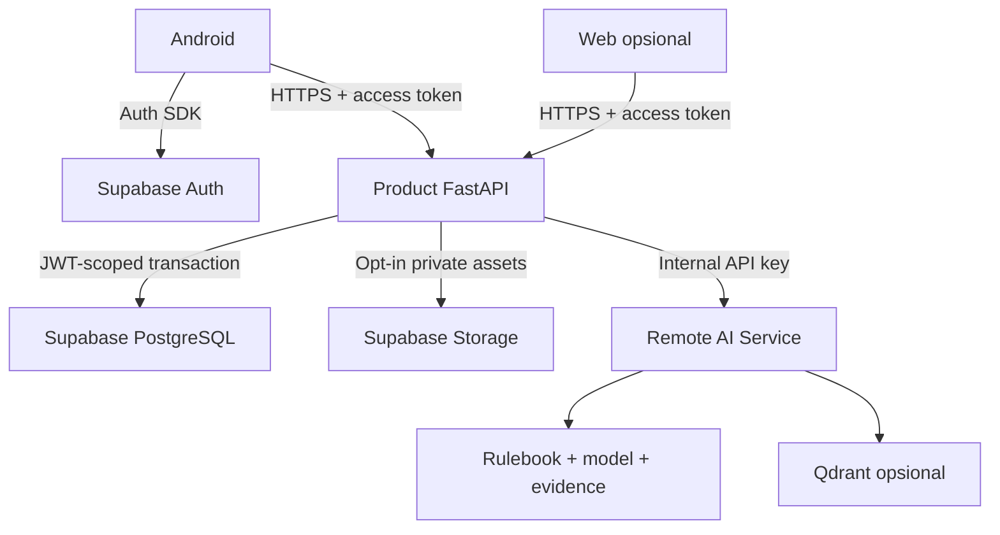
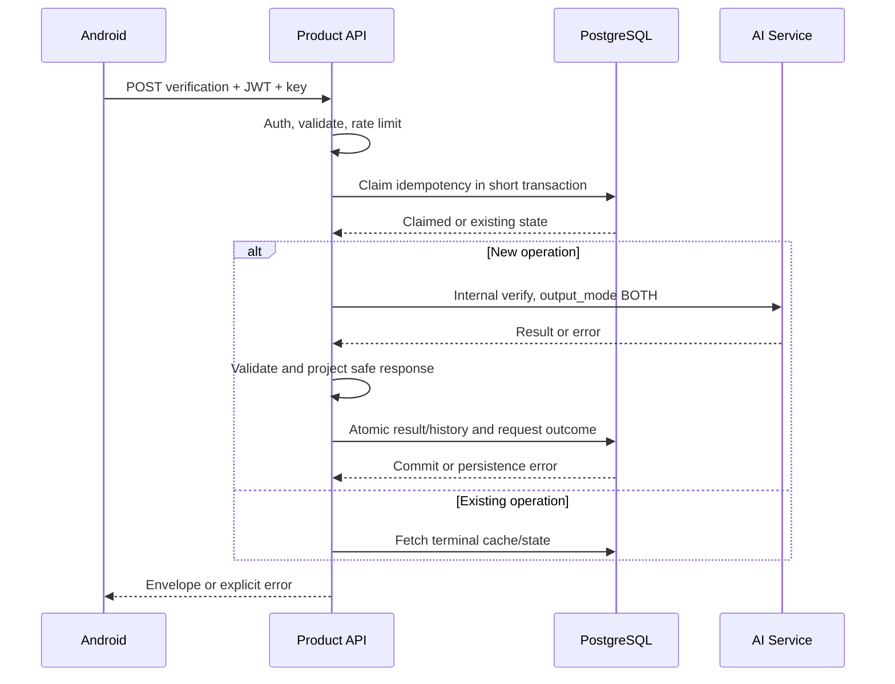

# WaspadAI — System and Detailed Folder Architecture

Versi 3.0.0-draft. Status TARGET. Semua tree di sini adalah rancangan file yang perlu diimplementasikan, bukan daftar source yang sudah ada dalam ZIP dokumentasi. [ADR](../adr/0001-product-ai-boundary.md) menentukan batas layanan; [database](database-architecture.md) menentukan schema.

## 1. Topologi dan trust boundary



Android tidak mempercayai state login lokal sebagai authorization server. Product tidak mempercayai request `user_id`/role/score. AI tidak menerima token session. Response AI juga input eksternal: schema, batas ukuran, URL tampilan dan metadata harus divalidasi. Qdrant adalah turunan milik AI, bukan database bisnis.

## 2. Struktur repository Product

```text
waspadai-product/
├── frontend/
│   ├── android/                         # Android Kotlin application
│   └── web/                             # Opsional; bukan copy wajib apps/web AI
├── backend/
│   ├── app/
│   ├── tests/
│   ├── scripts/
│   ├── Dockerfile
│   ├── pyproject.toml
│   └── requirements.lock               # Pilih satu workflow lock dependency
├── contracts/
│   ├── product-api.openapi.yaml
│   ├── upstream/
│   │   ├── contract-lock.json
│   │   └── waspadai-ai.openapi.json     # Wajib file asli; belum tersedia dalam paket
│   └── examples/
├── supabase/
│   ├── config.toml
│   ├── migrations/
│   ├── seeds/
│   ├── seed.sql
│   └── tests/
├── infrastructure/
│   ├── nginx/product.conf
│   └── deployment/
├── scripts/
│   ├── validate_contracts.py
│   ├── secret_scan.sh
│   └── smoke_product.py
├── tests/e2e/
├── docs/
│   ├── product/prd.md
│   ├── architecture/system-and-folder-architecture.md
│   ├── architecture/database-architecture.md
│   ├── integration/ai-service.md
│   ├── development/setup.md
│   └── adr/0001-product-ai-boundary.md
├── .github/workflows/ci.yml
├── compose.yaml
├── .env.example
├── .gitignore
└── README.md
```

Hanya tujuh Markdown, termasuk root README. README per subfolder, START_HERE, glossary, roadmap, test-strategy dan runbook terpisah tidak diperlukan pada init; link ke bagian dokumen yang memiliki topik tersebut.

## 3. Android: struktur rinci

Satu Gradle application module untuk MVP; fitur dipisah package, bukan puluhan Gradle module sejak awal. Root package proposal `id.waspadai.app`; applicationId final harus dikonfirmasi sebelum signing/release.

```text
frontend/android/
├── app/
│   ├── src/main/
│   │   ├── AndroidManifest.xml
│   │   ├── java/id/waspadai/app/
│   │   │   ├── WaspadAIApplication.kt
│   │   │   ├── MainActivity.kt
│   │   │   ├── core/
│   │   │   │   ├── common/{AppResult,CoroutineDispatchers,ClockProvider}.kt
│   │   │   │   ├── model/{VerificationResult,HistoryItem,CommunityState}.kt
│   │   │   │   ├── network/
│   │   │   │   │   ├── ProductApi.kt
│   │   │   │   │   ├── ApiClient.kt
│   │   │   │   │   ├── AuthInterceptor.kt
│   │   │   │   │   ├── TokenRefreshCoordinator.kt
│   │   │   │   │   ├── IdempotencyKeyStore.kt
│   │   │   │   │   ├── NetworkMonitor.kt
│   │   │   │   │   ├── ApiErrorMapper.kt
│   │   │   │   │   └── dto/
│   │   │   │   ├── auth/{SessionManager,SupabaseAuthClient,TokenProvider}.kt
│   │   │   │   ├── database/{WaspadAIDatabase,CachePolicy}.kt
│   │   │   │   ├── database/dao/
│   │   │   │   ├── database/entity/
│   │   │   │   ├── datastore/{AppPreferences,PermissionPreferences}.kt
│   │   │   │   ├── permissions/
│   │   │   │   │   ├── PermissionCoordinator.kt
│   │   │   │   │   ├── OverlayPermissionManager.kt
│   │   │   │   │   └── MediaProjectionPermissionManager.kt
│   │   │   │   ├── overlay/{FloatingVerifyService,OverlayController,OverlayState}.kt
│   │   │   │   ├── capture/
│   │   │   │   │   ├── ScreenCaptureService.kt
│   │   │   │   │   ├── MediaProjectionController.kt
│   │   │   │   │   ├── ScreenshotProcessor.kt
│   │   │   │   │   └── CaptureResult.kt
│   │   │   │   ├── ocr/{OcrEngine,OcrResult,TextBlockMapper}.kt
│   │   │   │   ├── privacy/{SensitiveTextRedactor,ConsentController}.kt
│   │   │   │   ├── image/{ImageCropper,ImageCompressor,ImageSanitizer}.kt
│   │   │   │   ├── navigation/{AppDestination,AppNavHost}.kt
│   │   │   │   ├── designsystem/{component,icon,theme,token}/
│   │   │   │   └── telemetry/{AnalyticsTracker,SafeCrashReporter}.kt
│   │   │   ├── feature/
│   │   │   │   ├── auth/
│   │   │   │   ├── onboarding/
│   │   │   │   ├── home/
│   │   │   │   ├── verification/
│   │   │   │   ├── result/
│   │   │   │   ├── history/
│   │   │   │   ├── learning/
│   │   │   │   ├── quiz/
│   │   │   │   ├── progress/
│   │   │   │   ├── community/
│   │   │   │   ├── contribution/
│   │   │   │   └── profile/
│   │   │   ├── worker/{ProgressSyncWorker,PrivateCacheCleanupWorker}.kt
│   │   │   └── di/{AppModule,NetworkModule,DatabaseModule,RepositoryModule}.kt
│   │   └── res/{drawable,font,mipmap,values,xml}/
│   ├── src/test/
│   ├── src/androidTest/
│   ├── build.gradle.kts
│   └── proguard-rules.pro
├── gradle/wrapper/
├── gradle/libs.versions.toml
├── gradlew
├── gradlew.bat
├── build.gradle.kts
├── settings.gradle.kts
├── gradle.properties
└── local.properties.example
```

Kurung kurawal pada tree hanya notasi pemadatan nama file sejenis, bukan nama path literal. Cache Room opsional untuk data sanitized/learning; bukan penyimpanan screenshot atau token plaintext. Jangan menambah PendingVerificationWorker yang menyimpan gambar diam-diam. Durable verification queue membutuhkan perubahan consent/retention dan bukan default.

### Struktur setiap feature

```text
feature/verification/
├── data/
│   ├── VerificationRepositoryImpl.kt
│   ├── VerificationRemoteDataSource.kt
│   └── mapper/VerificationMapper.kt
├── domain/
│   ├── VerificationRepository.kt
│   ├── SubmitTextVerificationUseCase.kt
│   └── SubmitImageVerificationUseCase.kt
└── presentation/
    ├── VerificationScreen.kt
    ├── VerificationViewModel.kt
    ├── VerificationUiState.kt
    ├── VerificationAction.kt
    └── component/
```

Dependency source: presentation bergantung pada domain; data mengimplementasikan interface domain; composition root/DI menghubungkan implementasi. Domain tidak mengimpor Retrofit/Supabase/Compose. Urutan panggilan runtime UI→ViewModel→use case→repository bukan berarti domain harus mengimpor implementation data.

### Kontrak perilaku Android

- Composable tidak memanggil HTTP; ViewModel memiliki state/action dan cancellation yang jelas.
- Session refresh single-flight; concurrent 401 tidak membuat refresh storm.
- Access token ditempel ke Product saja; interceptor tidak menempel token ke sembarang URL evidence.
- Key idempotency tetap untuk satu aksi dan payload yang sama; input berubah berarti aksi/key baru.
- Capture service menangani lifecycle/foreground notification/permission menurut Android target yang dipin. Tidak memakai kembali token/projection yang tidak lagi valid.
- ImageReader/VirtualDisplay/MediaProjection release pada semua jalur. Jangan mengakali protected screen.
- Strip metadata, crop dan kompres tanpa merusak keterbacaan; ukuran file/pixel diuji sebelum upload.
- OCR untuk review; image dikirim binary multipart. Tidak ada Base64 JSON.
- Loading UI tidak menjanjikan stage internal AI yang tidak dilaporkan. Untuk synchronous API gunakan “Sedang memeriksa”, elapsed time dan aksi aman.
- Content image/text tidak dipersist sebelum consent. Logout membersihkan cache yang terikat user.
- Network security cleartext hanya build debug dan host lokal yang diperlukan. Release wajib TLS verification aktif.
- `backup_rules.xml`/`data_extraction_rules.xml` mengecualikan session/private cache; service secrets tidak pernah ada di BuildConfig.

## 4. Product backend: struktur rinci

```text
backend/app/
├── main.py                              # App factory, lifespan, router registration
├── api/
│   ├── router.py
│   ├── dependencies/
│   │   ├── auth.py                       # Validate token → trusted principal
│   │   ├── roles.py                      # Moderator/admin from trusted DB
│   │   ├── database.py                   # Short scoped transaction
│   │   ├── idempotency.py
│   │   └── request_context.py
│   └── v1/routes/
│       ├── health.py
│       ├── me.py
│       ├── verifications.py
│       ├── history.py
│       ├── community.py
│       ├── contributions.py
│       ├── moderation.py
│       └── learning.py
├── core/
│   ├── config.py                        # Validate env and enforce remote in production
│   ├── security.py
│   ├── exceptions.py
│   ├── rate_limit.py
│   └── logging.py
├── domain/
│   ├── verification/{models,policies}.py
│   ├── community/{models,state_machine}.py
│   ├── learning/{models,scoring}.py
│   └── common/{identifiers,clock}.py
├── schemas/
│   ├── common.py
│   ├── verification.py
│   ├── history.py
│   ├── community.py
│   ├── contribution.py
│   ├── moderation.py
│   ├── learning.py
│   └── profile.py
├── services/
│   ├── verification_service.py
│   ├── history_service.py
│   ├── community_service.py
│   ├── preview_service.py
│   ├── voting_service.py
│   ├── contribution_service.py
│   ├── moderation_service.py
│   ├── learning_service.py
│   └── retention_service.py
├── integrations/waspadai_ai/
│   ├── client.py                        # Pooled async HTTP, internal endpoints only
│   ├── schemas.py                       # Exact upstream models once snapshot verified
│   ├── mapper.py                        # Product ↔ AI; no verdict calculation
│   ├── exceptions.py
│   ├── mock.py                          # Explicit labelled fixture provider
│   └── capabilities.py                  # Verified integration capability configuration
├── repositories/
│   ├── interfaces/
│   └── postgres/
│       ├── verification_repository.py
│       ├── idempotency_repository.py
│       ├── community_repository.py
│       ├── contribution_repository.py
│       ├── moderation_repository.py
│       ├── learning_repository.py
│       ├── outbox_repository.py
│       └── audit_repository.py
├── clients/
│   ├── postgres.py                      # Restricted runtime role, pool and SSL
│   ├── supabase_auth.py
│   └── supabase_storage.py               # Server-controlled paths and signed URLs
├── privacy/
│   ├── text_redaction.py
│   ├── image_validation.py
│   ├── response_projection.py
│   └── consent.py
├── middleware/{request_id,error_handler,access_log}.py
├── workers/
│   ├── community_sync_worker.py
│   ├── retention_worker.py
│   └── idempotency_cleanup_worker.py
└── observability/{metrics,tracing,audit}.py
```

Routes hanya parsing/dependencies/delegation/status response. Service memiliki workflow, domain memiliki invariant/state transition, repository memiliki SQL/transactions. `integrations/waspadai_ai/mapper.py` tidak menyusun prompt, ranking, mengubah risk ataupun membuat evidence. Privacy Product tidak menggantikan privacy enforcement AI.

Tidak ada `backend/app/ai/`, Groq/Tavily/Qdrant client, corpus Rulebook, model weights, embedding generator atau AI evaluation runner. `verification_rulebook_matches` adalah snapshot output, bukan remote retrieval engine.

### Tests dan scripts

```text
backend/tests/
├── unit/{auth,domain,services,integrations,privacy}/
├── integration/{api,postgres,storage}/
├── contract/{test_product_schema,test_ai_fixture,test_upstream_lock}.py
├── security/{test_cross_user,test_role_escalation,test_secret_leak}.py
├── fixtures/{ai_results,requests,errors}/
└── conftest.py
backend/scripts/
├── export_openapi.py
├── seed_learning.py
└── smoke_test.py
```

Tests AI internal tetap di AI repo. Smoke remote membutuhkan persetujuan operasi/test budget tim; unit test tidak bergantung internet atau credential production.

## 5. Web opsional

```text
frontend/web/
├── src/app/{login,moderation,contributions,community,learning}/
├── src/components/{ui,layout,feedback}/
├── src/features/{moderation,contributions,community}/
├── src/lib/{api,auth,validation}/
├── src/hooks/
├── src/types/
├── public/
├── tests/
├── package.json
├── package-lock.json
├── next.config.ts
└── .env.example
```

UI moderator bukan auth boundary: endpoint server tetap memeriksa role. Body Markdown user disanitasi saat render; tidak mengaktifkan raw HTML/script. `NEXT_PUBLIC_*` hanya URL/public key, tidak ada service secret. Web AI yang sudah ada tetap bisa dipakai sebagai demo AI milik Shafwan; bukan bukti bahwa Product web telah tersedia.

## 6. Runtime workflow dan failure boundary



Tidak ada transaksi/row lock DB ditahan selama AI berjalan. Idempotency claim memiliki lease/state; lease habis bukan bukti inferensi gagal. Worker/operator harus membedakan UNKNOWN_OUTCOME dari belum dipanggil. Detail replay ada di integrasi.

Community transaksi: validate consent/revision → insert/update canonical records + append decision/audit + outbox → commit. Worker claim event dalam transaksi pendek, commit claim, lalu call AI di luar transaksi; ack/retry terpisah. Worker tidak memegang koneksi terkunci selama network call.

## 7. Security/privasi lintas komponen

| Boundary | Pengendalian |
|---|---|
| Client→Product | TLS, access token validation, owner/role, body limit, rate limit, safe error |
| Product→DB | Role runtime non-superuser/NOBYPASSRLS, JWT context transaction-local, parameterized SQL |
| Product→Storage | Bucket privat, path dibentuk server, MIME/size validation, expiry, short signed URL |
| Product→AI | Internal key, TLS/private network, fixed allowlisted base URL, no user credential forwarding |
| URL evidence→browser | HTTP(S) only, jangan embed arbitrary script, buka sebagai external link aman |
| AI→provider | Ditangani AI engineer: URL/PII sanitasi, guardrail, bounded fan-out |

Service-role Supabase hanya untuk pekerjaan internal tertentu. RLS tidak melindungi query yang dijalankan memakai role yang bypass RLS; karena itu runtime DB role harus dibatasi dan owner check tetap diuji. Health response tidak memaparkan DSN/provider key; `/api/ready` detail hanya operator.

## 8. Configuration dan naming

Nama aktif Product `AI_SERVICE_BASE_URL`, `AI_SERVICE_API_KEY`, `AI_SERVICE_MODE`. Alias lama `WASPADAI_AI_*` pada arsip harus dimigrasikan, bukan dibaca bersamaan dengan precedence samar. Python snake_case; Kotlin PascalCase untuk class dan camelCase untuk property; tabel/kolom snake_case; timestamp UTC `timestamptz`; wire enums uppercase sesuai kontrak.

Semua base URL tanpa suffix `/api/v1`; endpoint path lengkap ditempel adapter. Dengan demikian tidak terjadi `/api/api/v1`. Android config `PRODUCT_API_BASE_URL`; config bukan tempat menyimpan AI URL/key.

## 9. Mapping fitur ke lokasi

| Fitur | Android | Product | Data |
|---|---|---|---|
| Auth | core/auth + feature/auth | dependencies/auth, roles | auth.users, profiles, user_roles |
| Overlay/capture | core/overlay + capture | Hanya validasi upload | Memory/temp, opt-in assets |
| OCR review | core/ocr + privacy | Tidak forward field tak didukung | Sanitized input summary bila perlu |
| Verifikasi | feature/verification | verification_service + AI adapter | request operations, cases, results |
| Detail/evidence | feature/result | safe response projection | evidence/rule match snapshots |
| History | feature/history | history_service | verification_cases |
| Learning/quiz | feature/learning, quiz, progress | learning_service/scoring | modules, lessons, questions, attempts |
| Koneksi/vote | feature/community | community/voting service | community_posts/votes |
| Contribution | feature/contribution | contribution_service | contributions/sources |
| Moderasi | Web opsional | moderation_service | decisions/audit/outbox |
| RAG sync | Tidak ada client index | community_sync_worker→AI | outbox; tidak ada embedding Product |

## 10. Migrasi dari rancangan lama

Tidak memindahkan `apps/api` AI ke backend Product. Jika Product repo baru: buat scaffold baru untuk gateway. Jika sudah ada source: audit working tree/dependency dahulu, pertahankan perubahan pengguna, pindahkan hanya modul yang memang milik Product lewat PR terpisah dengan baseline tests. Tidak melakukan rename besar saat demo path belum stabil.

Komponen yang tidak dibangun pada baseline ini: social friend connections, AI admin Rulebook UI di Product, evidence refresh worker provider, auto capture queue. Rinciannya tetap di arsip untuk roadmap, bukan syarat init.

## 11. Definition of Done arsitektur

Android/Product build lulus; tidak ada import lintas AI repo; dependency direction dites; config tidak berisi secret client; routes sesuai Product OpenAPI; local phone connectivity diuji; RLS tersedia dari migration; cleanup/error paths teruji; ADR, README dan struktur aktual sinkron. Qdrant/index tidak menjadi dependency startup Product.


## Lampiran historis utuh — Pasted markdown (2).md

**NON-NORMATIVE / ARSIP.** Isi berikut dipertahankan tanpa pemangkasan untuk audit detail sumber. Ini bukan spesifikasi aktif. Arsitektur monorepo AI, endpoint direct, status CURRENT, enum, nama tabel, resep SQL, metode vote, policy history/retensi dan perintah setup di dalamnya dapat bertentangan dengan keputusan terbaru; gunakan bagian aktif dokumen dan ADR. Jangan menjalankan perintah arsip atau mengklaim angka benchmark/test sebagai hasil pemeriksaan saat ini.

<details>
<summary>Buka seluruh isi sumber terdahulu</summary>

~~~~text
**# WaspadAI — Detailed Folder Architecture**

**\*\*Status:\*\*** Target Architecture  

**\*\*Scope:\*\*** MVP Hackathon 2026  

**\*\*Last Updated:\*\*** 14 September 2026  

**\*\*Repository Type:\*\*** Monorepo  

**\*\*Primary Client:\*\*** Android  

**\*\*Backend:\*\*** FastAPI  

**\*\*Database and Authentication:\*\*** Supabase  

**---**

**## 1. Tujuan**

Dokumen ini menjadi acuan penempatan file dan pemisahan tanggung jawab kode WaspadAI.

Arsitektur membagi repository menjadi dua area utama:

\- \`frontend/\`: aplikasi yang berinteraksi langsung dengan pengguna.

\- \`backend/\`: API, orkestrasi AI, retrieval, moderation, dan akses data sensitif.

Struktur ini dirancang untuk mendukung:

\- Android overlay.

\- MediaProjection.

\- OCR.

\- Vision analysis.

\- Rulebook retrieval.

\- Evidence retrieval.

\- Six-dimension assessment.

\- History.

\- Pelajari.

\- Quiz.

\- Progress.

\- Koneksi.

\- Contribution.

\- Moderation.

\- Verified Community RAG.

\- Authentication.

**---**

**## 2. Prinsip Arsitektur**

1\. Frontend tidak boleh menyimpan provider API key.

2\. Frontend hanya berkomunikasi dengan backend melalui public API.

3\. Backend menjadi satu-satunya entry point menuju AI provider dan evidence provider.

4\. Supabase service-role key hanya boleh digunakan di backend.

5\. Business logic tidak ditempatkan di route atau UI.

6\. Setiap fitur memiliki folder yang jelas.

7\. OpenAPI menjadi kontrak komunikasi frontend dan backend.

8\. Database hanya diubah melalui migration.

9\. Pipeline AI dapat dites tanpa menjalankan HTTP server.

10\. Kode AI existing milik AI Engineer harus dipertahankan dan dipindahkan secara bertahap.

**---**

**## 3. Struktur Repository Utama**

\`\`\`text

waspadai/

├── frontend/

│   ├── android/

│   └── web/

│

├── backend/

│   ├── app/

│   ├── tests/

│   ├── scripts/

│   ├── Dockerfile

│   ├── pyproject.toml

│   ├── requirements.txt

│   ├── .env.example

│   └── README.md

│

├── contracts/

│   ├── openapi.json

│   ├── schemas/

│   ├── examples/

│   └── README.md

│

├── supabase/

│   ├── migrations/

│   ├── seed/

│   ├── tests/

│   ├── config.toml

│   └── README.md

│

├── infrastructure/

│   ├── docker/

│   ├── deployment/

│   ├── monitoring/

│   └── README.md

│

├── scripts/

│   ├── bootstrap/

│   ├── development/

│   ├── validation/

│   └── README.md

│

├── tests/

│   ├── contract/

│   ├── e2e/

│   └── smoke/

│

├── docs/

│   ├── architecture/

│   ├── api/

│   ├── ai/

│   ├── database/

│   ├── development/

│   ├── product/

│   ├── project-management/

│   ├── security/

│   └── testing/

│

├── .github/

│   ├── workflows/

│   ├── ISSUE\_TEMPLATE/

│   └── pull\_request\_template.md

│

├── .gitignore

├── docker-compose.yml

├── Makefile

├── README.md

└── START\_HERE.md

\`\`\`

**---**

**# 4. Frontend Architecture**

**## 4.1 Frontend Android**

Android merupakan aplikasi utama WaspadAI. Untuk MVP, gunakan satu Gradle application module dan lakukan pemisahan berdasarkan fitur.

\`\`\`text

frontend/android/

├── app/

│   ├── src/

│   │   ├── main/

│   │   │   ├── java/id/waspadai/app/

│   │   │   │   ├── WaspadAIApplication.kt

│   │   │   │   ├── MainActivity.kt

│   │   │   │   │

│   │   │   │   ├── core/

│   │   │   │   │   ├── common/

│   │   │   │   │   │   ├── AppResult.kt

│   │   │   │   │   │   ├── CoroutineDispatchers.kt

│   │   │   │   │   │   └── Constants.kt

│   │   │   │   │   │

│   │   │   │   │   ├── model/

│   │   │   │   │   │   ├── VerificationCase.kt

│   │   │   │   │   │   ├── VerificationResult.kt

│   │   │   │   │   │   ├── AssessmentDimension.kt

│   │   │   │   │   │   ├── Evidence.kt

│   │   │   │   │   │   └── RiskStatus.kt

│   │   │   │   │   │

│   │   │   │   │   ├── network/

│   │   │   │   │   │   ├── WaspadAIApi.kt

│   │   │   │   │   │   ├── ApiClient.kt

│   │   │   │   │   │   ├── AuthInterceptor.kt

│   │   │   │   │   │   ├── NetworkMonitor.kt

│   │   │   │   │   │   └── dto/

│   │   │   │   │   │

│   │   │   │   │   ├── auth/

│   │   │   │   │   │   ├── SessionManager.kt

│   │   │   │   │   │   ├── SupabaseAuthClient.kt

│   │   │   │   │   │   └── TokenProvider.kt

│   │   │   │   │   │

│   │   │   │   │   ├── database/

│   │   │   │   │   │   ├── WaspadAIDatabase.kt

│   │   │   │   │   │   ├── dao/

│   │   │   │   │   │   └── entity/

│   │   │   │   │   │

│   │   │   │   │   ├── datastore/

│   │   │   │   │   │   ├── AppPreferences.kt

│   │   │   │   │   │   └── PermissionPreferences.kt

│   │   │   │   │   │

│   │   │   │   │   ├── permissions/

│   │   │   │   │   │   ├── PermissionCoordinator.kt

│   │   │   │   │   │   ├── OverlayPermissionManager.kt

│   │   │   │   │   │   └── MediaProjectionPermissionManager.kt

│   │   │   │   │   │

│   │   │   │   │   ├── overlay/

│   │   │   │   │   │   ├── FloatingVerifyService.kt

│   │   │   │   │   │   ├── OverlayController.kt

│   │   │   │   │   │   ├── OverlayState.kt

│   │   │   │   │   │   └── OverlayViewFactory.kt

│   │   │   │   │   │

│   │   │   │   │   ├── capture/

│   │   │   │   │   │   ├── ScreenCaptureService.kt

│   │   │   │   │   │   ├── MediaProjectionController.kt

│   │   │   │   │   │   ├── ScreenshotProcessor.kt

│   │   │   │   │   │   └── CaptureResult.kt

│   │   │   │   │   │

│   │   │   │   │   ├── ocr/

│   │   │   │   │   │   ├── OcrEngine.kt

│   │   │   │   │   │   ├── OcrResult.kt

│   │   │   │   │   │   ├── TextBlockMapper.kt

│   │   │   │   │   │   └── SensitiveTextRedactor.kt

│   │   │   │   │   │

│   │   │   │   │   ├── image/

│   │   │   │   │   │   ├── ImageCompressor.kt

│   │   │   │   │   │   ├── ImageCropper.kt

│   │   │   │   │   │   ├── ImageSanitizer.kt

│   │   │   │   │   │   └── ImageEncoder.kt

│   │   │   │   │   │

│   │   │   │   │   ├── navigation/

│   │   │   │   │   │   ├── AppDestination.kt

│   │   │   │   │   │   ├── AppNavHost.kt

│   │   │   │   │   │   └── NavigationCoordinator.kt

│   │   │   │   │   │

│   │   │   │   │   ├── designsystem/

│   │   │   │   │   │   ├── component/

│   │   │   │   │   │   ├── icon/

│   │   │   │   │   │   ├── theme/

│   │   │   │   │   │   └── token/

│   │   │   │   │   │

│   │   │   │   │   └── telemetry/

│   │   │   │   │       ├── AnalyticsTracker.kt

│   │   │   │   │       └── CrashReporter.kt

│   │   │   │   │

│   │   │   │   ├── feature/

│   │   │   │   │   ├── auth/

│   │   │   │   │   │   ├── data/

│   │   │   │   │   │   ├── domain/

│   │   │   │   │   │   └── presentation/

│   │   │   │   │   │

│   │   │   │   │   ├── onboarding/

│   │   │   │   │   ├── home/

│   │   │   │   │   ├── verification/

│   │   │   │   │   ├── result/

│   │   │   │   │   ├── history/

│   │   │   │   │   ├── learning/

│   │   │   │   │   ├── quiz/

│   │   │   │   │   ├── progress/

│   │   │   │   │   ├── connections/

│   │   │   │   │   ├── contribution/

│   │   │   │   │   └── profile/

│   │   │   │   │

│   │   │   │   ├── worker/

│   │   │   │   │   ├── PendingVerificationWorker.kt

│   │   │   │   │   ├── ContributionUploadWorker.kt

│   │   │   │   │   └── ProgressSyncWorker.kt

│   │   │   │   │

│   │   │   │   └── di/

│   │   │   │       ├── AppModule.kt

│   │   │   │       ├── NetworkModule.kt

│   │   │   │       ├── DatabaseModule.kt

│   │   │   │       └── RepositoryModule.kt

│   │   │   │

│   │   │   ├── res/

│   │   │   │   ├── drawable/

│   │   │   │   ├── font/

│   │   │   │   ├── mipmap/

│   │   │   │   ├── values/

│   │   │   │   └── xml/

│   │   │   │       ├── backup\_rules.xml

│   │   │   │       ├── data\_extraction\_rules.xml

│   │   │   │       └── network\_security\_config.xml

│   │   │   │

│   │   │   └── AndroidManifest.xml

│   │   │

│   │   ├── test/

│   │   └── androidTest/

│   │

│   ├── build.gradle.kts

│   └── proguard-rules.pro

│

├── gradle/

├── build.gradle.kts

├── settings.gradle.kts

├── gradle.properties

├── local.properties.example

└── README.md

\`\`\`

**### Struktur internal setiap feature**

Gunakan struktur berikut untuk fitur yang memiliki UI dan business logic:

\`\`\`text

feature/verification/

├── data/

│   ├── VerificationRepositoryImpl.kt

│   ├── VerificationRemoteDataSource.kt

│   └── mapper/

├── domain/

│   ├── VerificationRepository.kt

│   ├── SubmitTextVerificationUseCase.kt

│   ├── SubmitImageVerificationUseCase.kt

│   └── ObserveVerificationUseCase.kt

└── presentation/

    ├── VerificationScreen.kt

    ├── VerificationViewModel.kt

    ├── VerificationUiState.kt

    ├── VerificationAction.kt

    └── component/

\`\`\`

**### Aturan Android**

\- Composable tidak boleh memanggil API secara langsung.

\- ViewModel memanggil use case.

\- Use case bergantung pada repository interface.

\- Repository implementation menangani API dan local cache.

\- MediaProjection dijalankan melalui foreground service.

\- Overlay harus memiliki lifecycle dan cleanup yang jelas.

\- Screenshot harus dikompresi dan disanitasi sebelum dikirim.

\- Hapus temporary screenshot setelah request selesai.

\- Jangan menyimpan \`WASPADAI\_API\_KEYS\` di Android.

\- Jangan menyimpan \`GROQ\_API\_KEY\`, \`TAVILY\_API\_KEY\`, atau service-role key di Android.

\- Android mengirim Supabase access token melalui \`Authorization: Bearer\`.

\- HTTP non-TLS hanya diperbolehkan untuk local development.

**---**

**## 4.2 Frontend Web**

Web existing dapat digunakan sebagai:

\- Demo browser.

\- Dashboard moderator.

\- Pengelolaan contribution.

\- Pengelolaan Rulebook.

\- Pengelolaan Verified Community RAG.

\- Observasi hasil verifikasi.

\`\`\`text

frontend/web/

├── src/

│   ├── app/

│   │   ├── (auth)/

│   │   │   └── login/

│   │   ├── (dashboard)/

│   │   │   ├── overview/

│   │   │   ├── moderation/

│   │   │   ├── contributions/

│   │   │   ├── knowledge/

│   │   │   ├── rulebook/

│   │   │   └── audit/

│   │   ├── verify/

│   │   ├── api/

│   │   ├── layout.tsx

│   │   └── page.tsx

│   │

│   ├── features/

│   │   ├── auth/

│   │   ├── verification/

│   │   ├── moderation/

│   │   ├── contribution/

│   │   ├── community-rag/

│   │   ├── rulebook/

│   │   └── audit/

│   │

│   ├── components/

│   │   ├── ui/

│   │   ├── layout/

│   │   ├── feedback/

│   │   └── visualization/

│   │

│   ├── lib/

│   │   ├── api/

│   │   ├── auth/

│   │   ├── supabase/

│   │   ├── validation/

│   │   └── utils/

│   │

│   ├── hooks/

│   ├── types/

│   └── styles/

│

├── public/

├── tests/

├── .env.example

├── next.config.ts

├── package.json

├── tsconfig.json

└── README.md

\`\`\`

Web bukan blocker Android MVP. Prioritaskan web untuk moderation apabila fitur tersebut tidak praktis dilakukan melalui Android.

**---**

**# 5. Backend Architecture**

Backend menangani seluruh proses sensitif:

\- Validasi authentication.

\- Verification orchestration.

\- OCR tambahan apabila diperlukan.

\- Vision analysis.

\- Rulebook retrieval.

\- Evidence retrieval.

\- Six-dimension assessment.

\- Penyimpanan history.

\- Learning dan quiz API.

\- Connections.

\- Contribution.

\- Moderation.

\- Verified Community RAG.

\- Audit log.

\`\`\`text

backend/

├── app/

│   ├── main.py

│   │

│   ├── api/

│   │   ├── dependencies/

│   │   │   ├── auth.py

│   │   │   ├── database.py

│   │   │   ├── internal\_api\_key.py

│   │   │   └── rate\_limit.py

│   │   │

│   │   ├── v1/

│   │   │   ├── public/

│   │   │   │   ├── health.py

│   │   │   │   ├── verification.py

│   │   │   │   ├── history.py

│   │   │   │   ├── learning.py

│   │   │   │   ├── quiz.py

│   │   │   │   ├── progress.py

│   │   │   │   ├── connections.py

│   │   │   │   └── contributions.py

│   │   │   │

│   │   │   ├── internal/

│   │   │   │   ├── verification.py

│   │   │   │   └── retrieval.py

│   │   │   │

│   │   │   └── admin/

│   │   │       ├── moderation.py

│   │   │       ├── knowledge.py

│   │   │       ├── rulebook.py

│   │   │       └── audit.py

│   │   │

│   │   └── router.py

│   │

│   ├── core/

│   │   ├── config.py

│   │   ├── security.py

│   │   ├── exceptions.py

│   │   ├── logging.py

│   │   ├── rate\_limit.py

│   │   └── constants.py

│   │

│   ├── domain/

│   │   ├── entities/

│   │   │   ├── verification.py

│   │   │   ├── assessment.py

│   │   │   ├── evidence.py

│   │   │   ├── contribution.py

│   │   │   └── learning.py

│   │   ├── enums/

│   │   │   ├── risk\_status.py

│   │   │   ├── moderation\_status.py

│   │   │   └── source\_type.py

│   │   └── exceptions/

│   │

│   ├── schemas/

│   │   ├── common.py

│   │   ├── auth.py

│   │   ├── verification.py

│   │   ├── assessment.py

│   │   ├── evidence.py

│   │   ├── history.py

│   │   ├── learning.py

│   │   ├── quiz.py

│   │   ├── progress.py

│   │   ├── connection.py

│   │   ├── contribution.py

│   │   └── moderation.py

│   │

│   ├── services/

│   │   ├── verification\_service.py

│   │   ├── history\_service.py

│   │   ├── learning\_service.py

│   │   ├── quiz\_service.py

│   │   ├── progress\_service.py

│   │   ├── connection\_service.py

│   │   ├── contribution\_service.py

│   │   ├── moderation\_service.py

│   │   └── community\_knowledge\_service.py

│   │

│   ├── ai/

│   │   ├── contracts/

│   │   │   ├── model\_provider.py

│   │   │   ├── retrieval\_provider.py

│   │   │   └── embedding\_provider.py

│   │   │

│   │   ├── pipelines/

│   │   │   ├── text\_verification\_pipeline.py

│   │   │   ├── image\_verification\_pipeline.py

│   │   │   ├── vision\_pipeline.py

│   │   │   ├── assessment\_pipeline.py

│   │   │   └── community\_rag\_pipeline.py

│   │   │

│   │   ├── extraction/

│   │   │   ├── claim\_extractor.py

│   │   │   ├── entity\_extractor.py

│   │   │   ├── url\_extractor.py

│   │   │   └── indicator\_extractor.py

│   │   │

│   │   ├── retrieval/

│   │   │   ├── rulebook\_retriever.py

│   │   │   ├── evidence\_retriever.py

│   │   │   ├── community\_retriever.py

│   │   │   ├── bm25\_ranker.py

│   │   │   ├── vector\_ranker.py

│   │   │   └── metadata\_ranker.py

│   │   │

│   │   ├── assessment/

│   │   │   ├── six\_dimension\_assessor.py

│   │   │   ├── risk\_calculator.py

│   │   │   ├── safe\_action\_generator.py

│   │   │   └── assessment\_validator.py

│   │   │

│   │   ├── moderation/

│   │   │   ├── contribution\_validator.py

│   │   │   ├── duplicate\_detector.py

│   │   │   └── safety\_filter.py

│   │   │

│   │   ├── providers/

│   │   │   ├── qwen\_provider.py

│   │   │   ├── gpt\_oss\_provider.py

│   │   │   ├── groq\_provider.py

│   │   │   ├── tavily\_provider.py

│   │   │   └── fake\_provider.py

│   │   │

│   │   ├── prompts/

│   │   │   ├── verification/

│   │   │   ├── vision/

│   │   │   ├── assessment/

│   │   │   └── learning/

│   │   │

│   │   ├── guardrails/

│   │   │   ├── input\_sanitizer.py

│   │   │   ├── output\_validator.py

│   │   │   ├── pii\_redactor.py

│   │   │   └── prompt\_injection\_filter.py

│   │   │

│   │   └── evaluation/

│   │       ├── datasets/

│   │       ├── metrics.py

│   │       └── runner.py

│   │

│   ├── repositories/

│   │   ├── interfaces/

│   │   │   ├── verification\_repository.py

│   │   │   ├── history\_repository.py

│   │   │   ├── learning\_repository.py

│   │   │   ├── contribution\_repository.py

│   │   │   └── knowledge\_repository.py

│   │   └── supabase/

│   │       ├── verification\_repository.py

│   │       ├── history\_repository.py

│   │       ├── learning\_repository.py

│   │       ├── contribution\_repository.py

│   │       └── knowledge\_repository.py

│   │

│   ├── clients/

│   │   ├── supabase\_client.py

│   │   ├── groq\_client.py

│   │   ├── tavily\_client.py

│   │   └── http\_client.py

│   │

│   ├── middleware/

│   │   ├── request\_id.py

│   │   ├── error\_handler.py

│   │   ├── access\_log.py

│   │   └── security\_headers.py

│   │

│   ├── workers/

│   │   ├── contribution\_indexing.py

│   │   ├── evidence\_refresh.py

│   │   └── cleanup.py

│   │

│   └── observability/

│       ├── metrics.py

│       ├── tracing.py

│       └── audit.py

│

├── tests/

│   ├── unit/

│   │   ├── ai/

│   │   ├── services/

│   │   └── repositories/

│   ├── integration/

│   │   ├── api/

│   │   ├── supabase/

│   │   └── providers/

│   ├── contract/

│   ├── security/

│   ├── fixtures/

│   └── conftest.py

│

├── scripts/

│   ├── export\_openapi.py

│   ├── seed\_rulebook.py

│   ├── seed\_learning.py

│   ├── evaluate\_pipeline.py

│   └── smoke\_test.py

│

├── Dockerfile

├── pyproject.toml

├── requirements.txt

├── .env.example

└── README.md

\`\`\`

**---**

**## 6. Backend Route Separation**

**### Public API**

Digunakan oleh Android dan web dengan Supabase access token.

\`\`\`text

/api/v1/verify/text

/api/v1/verify/image

/api/v1/history

/api/v1/learning

/api/v1/quiz

/api/v1/progress

/api/v1/connections

/api/v1/contributions

\`\`\`

Authentication:

\`\`\`http

Authorization: Bearer \<supabase-access-token>

\`\`\`

**### Internal API**

Digunakan untuk komunikasi service-to-service.

\`\`\`text

/api/internal/v1/verify/text

/api/internal/v1/verify/image

\`\`\`

Authentication:

\`\`\`http

X-Waspadai-API-Key: \<internal-api-key>

\`\`\`

Nilai \`WASPADAI\_API\_KEYS\` hanya berada di backend. Android dan web tidak boleh mengetahui key tersebut.

**### Admin API**

Digunakan oleh moderator atau administrator.

\`\`\`text

/api/v1/admin/moderation

/api/v1/admin/contributions

/api/v1/admin/knowledge

/api/v1/admin/rulebook

/api/v1/admin/audit

\`\`\`

Admin API menggunakan Supabase JWT dan pemeriksaan role di backend.

**---**

**# 7. Supabase Architecture**

\`\`\`text

supabase/

├── migrations/

│   ├── 202609140001\_create\_profiles.sql

│   ├── 202609140002\_create\_verification\_cases.sql

│   ├── 202609140003\_create\_assessment\_dimensions.sql

│   ├── 202609140004\_create\_evidence\_and\_rulebook.sql

│   ├── 202609140005\_create\_learning\_and\_quiz.sql

│   ├── 202609140006\_create\_progress.sql

│   ├── 202609140007\_create\_connections.sql

│   ├── 202609140008\_create\_contributions.sql

│   ├── 202609140009\_create\_moderation.sql

│   ├── 202609140010\_create\_community\_rag.sql

│   └── 202609140011\_create\_rls\_and\_audit.sql

│

├── seed/

│   ├── development.sql

│   ├── rulebook.sql

│   ├── learning\_modules.sql

│   └── quiz\_questions.sql

│

├── tests/

│   ├── rls/

│   ├── functions/

│   └── migrations/

│

├── config.toml

└── README.md

\`\`\`

**### Kelompok tabel utama**

\| Domain | Tabel |

\|---|---|

\| User | \`profiles\`, \`user\_roles\` |

\| Verification | \`verification\_cases\`, \`verification\_inputs\`, \`verification\_results\` |

\| Assessment | \`assessment\_dimensions\`, \`assessment\_scores\` |

\| Evidence | \`evidence\_sources\`, \`evidence\_items\` |

\| Rulebook | \`rulebook\_documents\`, \`rulebook\_chunks\` |

\| Learning | \`learning\_modules\`, \`learning\_lessons\` |

\| Quiz | \`quiz\_questions\`, \`quiz\_attempts\`, \`quiz\_answers\` |

\| Progress | \`user\_progress\`, \`learning\_completions\` |

\| Connection | \`connections\`, \`connection\_requests\` |

\| Contribution | \`contributions\`, \`contribution\_sources\` |

\| Moderation | \`moderation\_queue\`, \`moderation\_decisions\` |

\| Community RAG | \`community\_documents\`, \`community\_chunks\` |

\| Audit | \`audit\_logs\` |

**### Verified Community RAG**

Hanya contribution dengan status \`verified\` yang boleh masuk ke retrieval index.

\`\`\`text

contribution submitted

        ↓

moderation\_queue

        ↓

moderation\_decision

        ↓

status = verified

        ↓

community\_document

        ↓

community\_chunks

        ↓

embedding/index

        ↓

community retrieval

\`\`\`

Status yang direkomendasikan:

\`\`\`text

draft

submitted

under\_review

needs\_revision

rejected

verified

archived

\`\`\`

**### Storage buckets**

\| Bucket | Akses | Isi |

\|---|---|---|

\| \`verification-inputs\` | Private | Screenshot atau gambar verifikasi |

\| \`contribution-evidence\` | Private | Bukti yang dikirim kontributor |

\| \`profile-assets\` | Private/Public terbatas | Avatar |

\| \`learning-assets\` | Public/read-only | Gambar materi pembelajaran |

File verifikasi sebaiknya memiliki retention policy dan tidak disimpan tanpa batas.

**---**

**# 8. API Contracts**

\`\`\`text

contracts/

├── openapi.json

├── schemas/

│   ├── verification-request.schema.json

│   ├── verification-result.schema.json

│   ├── assessment-dimension.schema.json

│   ├── evidence.schema.json

│   ├── contribution.schema.json

│   └── moderation-decision.schema.json

│

├── examples/

│   ├── verify-text-request.json

│   ├── verify-image-response.json

│   ├── assessment-response.json

│   └── contribution-response.json

│

└── README.md

\`\`\`

Aturan kontrak:

\- FastAPI menjadi source of truth OpenAPI.

\- \`contracts/openapi.json\` dihasilkan dari backend.

\- Android DTO harus mengikuti OpenAPI.

\- Perubahan response wajib memperbarui contract test.

\- Six-dimension assessment harus selalu menggunakan struktur konsisten.

Contoh struktur dimension:

\`\`\`json

{

  "dimension\_id": "dimension\_identifier",

  "score": 0.0,

  "risk\_level": "low",

  "rationale": "Penjelasan hasil penilaian",

  "evidence\_refs": ["evidence-id"],

  "rulebook\_refs": ["rulebook-id"]

}

\`\`\`

**---**

**# 9. End-to-End Data Flow**

\`\`\`mermaid

flowchart TD

    A["Android atau Web"] --> B["FastAPI Public API"]

    B --> C["Verification Service"]

    C --> D["AI, Rulebook, dan Evidence Pipeline"]

    D --> E["Supabase dan Audit Log"]

\`\`\`

Urutan verifikasi gambar:

1\. Pengguna menekan floating overlay.

2\. Android meminta persetujuan MediaProjection.

3\. Android mengambil screenshot.

4\. Android melakukan crop, kompresi, sanitasi, dan OCR lokal.

5\. Android mengirim gambar dan hasil OCR ke public API.

6\. Backend memvalidasi JWT dan input.

7\. Vision pipeline mengekstrak klaim serta indikator.

8\. Rulebook retrieval menentukan aturan pemeriksaan.

9\. Evidence retrieval mencari bukti pendukung atau pembantah.

10\. Six-dimension assessor menghasilkan penilaian.

11\. Backend menentukan risk status dan safe action.

12\. Hasil disimpan sebagai history.

13\. Android menampilkan ringkasan dan detail evidence.

**---**

**# 10. Feature-to-Folder Mapping**

\| Fitur | Android | Backend | Database |

\|---|---|---|---|

\| Authentication | \`feature/auth\` | \`api/dependencies/auth.py\` | Supabase Auth, \`profiles\` |

\| Android overlay | \`core/overlay\` | — | — |

\| MediaProjection | \`core/capture\` | — | — |

\| OCR | \`core/ocr\` | \`ai/extraction\` bila diperlukan | — |

\| Vision | \`feature/verification\` | \`ai/pipelines/vision\_pipeline.py\` | \`verification\_inputs\` |

\| Rulebook retrieval | Result UI | \`ai/retrieval/rulebook\_retriever.py\` | \`rulebook\_\*\` |

\| Evidence retrieval | Result UI | \`ai/retrieval/evidence\_retriever.py\` | \`evidence\_\*\` |

\| Six-dimension assessment | \`feature/result\` | \`ai/assessment\` | \`assessment\_\*\` |

\| History | \`feature/history\` | \`history\_service.py\` | \`verification\_cases\` |

\| Pelajari | \`feature/learning\` | \`learning\_service.py\` | \`learning\_\*\` |

\| Quiz | \`feature/quiz\` | \`quiz\_service.py\` | \`quiz\_\*\` |

\| Progress | \`feature/progress\` | \`progress\_service.py\` | \`user\_progress\` |

\| Koneksi | \`feature/connections\` | \`connection\_service.py\` | \`connections\` |

\| Contribution | \`feature/contribution\` | \`contribution\_service.py\` | \`contributions\` |

\| Moderation | \`frontend/web/features/moderation\` | \`moderation\_service.py\` | \`moderation\_\*\` |

\| Community RAG | Result/community UI | \`community\_rag\_pipeline.py\` | \`community\_\*\` |

\| Audit | — | \`observability/audit.py\` | \`audit\_logs\` |

**---**

**# 11. Environment Configuration**

**## Android**

Android tidak menggunakan backend \`.env\`.

\`\`\`properties

\# frontend/android/local.properties

WASPADAI\_BASE\_URL=http\://127.0.0.1:8001

SUPABASE\_URL=https\://project.supabase.co

SUPABASE\_ANON\_KEY=public-anon-key

\`\`\`

\`local.properties\` tidak boleh di-commit.

Untuk physical device melalui USB:

\`\`\`bash

adb reverse tcp:8001 tcp:8001

\`\`\`

Android kemudian dapat mengakses backend laptop melalui:

\`\`\`text

http\://127.0.0.1:8001

\`\`\`

**## Web**

\`\`\`dotenv

NEXT\_PUBLIC\_API\_BASE\_URL=http\://localhost:8001

NEXT\_PUBLIC\_SUPABASE\_URL=https\://project.supabase.co

NEXT\_PUBLIC\_SUPABASE\_ANON\_KEY=public-anon-key

\`\`\`

**## Backend**

\`\`\`dotenv

APP\_ENV=development

APP\_PORT=8001

SUPABASE\_URL=https\://project.supabase.co

SUPABASE\_ANON\_KEY=public-anon-key

SUPABASE\_SERVICE\_ROLE\_KEY=server-only-secret

WASPADAI\_API\_KEYS=change-me

GROQ\_API\_KEY=server-only-secret

TAVILY\_API\_KEY=server-only-secret

\`\`\`

Rules:

\- \`.env\` tidak boleh di-commit.

\- Hanya \`.env.example\` yang disimpan.

\- \`.env.example\` tidak boleh berisi key asli.

\- OpenAI API key untuk Codex CLI tidak dimasukkan ke konfigurasi aplikasi.

\- \`WASPADAI\_API\_KEYS\` bukan OpenAI API key.

\- Service-role key tidak boleh memakai prefix \`NEXT\_PUBLIC\_\`.

\- Android tidak boleh memiliki internal API key.

**---**

**# 12. Dependency Direction**

**## Android**

\`\`\`text

presentation

    ↓

domain/use-case

    ↓

repository interface

    ↓

repository implementation

    ↓

network/local storage

\`\`\`

Core tidak boleh bergantung pada feature.

**## Backend**

\`\`\`text

API route

    ↓

service

    ↓

domain and AI pipeline

    ↓

repository or provider interface

    ↓

Supabase and external provider

\`\`\`

Larangan:

\- Route tidak menulis query database secara langsung.

\- Route tidak menyusun prompt.

\- Prompt tidak melakukan HTTP request.

\- AI pipeline tidak mengimpor FastAPI route.

\- Repository tidak mengandung UI response formatting.

\- Frontend tidak mengakses provider AI secara langsung.

\- Frontend tidak menggunakan Supabase service-role key.

**---**

**# 13. Migration dari Existing Repository**

Existing repository memiliki:

\`\`\`text

apps/api

apps/web

contracts/openapi.json

\`\`\`

Target mapping:

\| Existing | Target |

\|---|---|

\| \`apps/api\` | \`backend\` |

\| \`apps/web\` | \`frontend/web\` |

\| Android baru | \`frontend/android\` |

\| \`contracts\` | Tetap \`contracts\` |

\| \`docs\` | Tetap \`docs\` |

\| Infrastructure existing | \`infrastructure\` |

Urutan migrasi:

1\. Jalankan seluruh baseline test.

2\. Catat hasil test sebelum pemindahan.

3\. Buat branch \`chore/restructure-monorepo\`.

4\. Pindahkan \`apps/api\` menjadi \`backend\`.

5\. Pindahkan \`apps/web\` menjadi \`frontend/web\`.

6\. Tambahkan \`frontend/android\`.

7\. Perbarui Docker Compose.

8\. Perbarui workflow CI.

9\. Perbarui path build dan deployment.

10\. Jalankan kembali backend test, web build, dan Android build.

11\. Merge hanya jika seluruh baseline kembali hijau.

Jika restrukturisasi memerlukan lebih dari 90 menit atau merusak AI baseline, gunakan struktur kompatibilitas sementara:

\`\`\`text

apps/

├── api/       # Logical backend

├── web/       # Logical frontend web

└── android/   # Logical frontend Android

\`\`\`

Jangan mengorbankan kestabilan demo hanya untuk memindahkan nama folder.

**---**

**# 14. Team Ownership**

\| Area | Primary Owner | Reviewer |

\|---|---|---|

\| \`frontend/android\` | PM/Technical | Designer |

\| \`frontend/web\` | PM/Technical | Designer |

\| \`backend/app/ai\` | AI Engineer | PM/Technical |

\| \`backend/app/api\` | PM/Technical | AI Engineer |

\| \`backend/app/services\` | PM/Technical | AI Engineer |

\| \`supabase\` | PM/Technical | AI Engineer |

\| UI assets dan design system | Product Designer | PM/Technical |

\| \`contracts\` | PM/Technical | AI Engineer |

\| AI evaluation | AI Engineer | PM/Technical |

\| Documentation | PM/Technical | Seluruh tim |

Code ownership bukan berarti anggota lain dilarang mengubah area tersebut. Perubahan tetap perlu direview oleh owner terkait.

**---**

**# 15. Naming Convention**

**## Kotlin**

\`\`\`text

VerificationScreen.kt

VerificationViewModel.kt

VerificationUiState.kt

SubmitVerificationUseCase.kt

VerificationRepository.kt

VerificationRepositoryImpl.kt

\`\`\`

**## Python**

\`\`\`text

verification\_service.py

verification\_repository.py

text\_verification\_pipeline.py

six\_dimension\_assessor.py

\`\`\`

**## Database**

\`\`\`text

verification\_cases

assessment\_dimensions

moderation\_decisions

created\_at

updated\_at

user\_id

\`\`\`

**## Branch**

\`\`\`text

feat/android-overlay

feat/media-projection

feat/verification-api

feat/community-rag

fix/image-upload-timeout

chore/restructure-monorepo

docs/folder-architecture

\`\`\`

**## Commit**

\`\`\`text

feat(android): add floating verification service

feat(api): add authenticated image verification endpoint

feat(ai): integrate rulebook and evidence retrieval

feat(moderation): add contribution approval workflow

fix(auth): refresh expired Supabase session

docs(architecture): define frontend and backend structure

\`\`\`

**---**

**# 16. Where Should This File Go?**

Gunakan panduan berikut saat menambahkan file.

\| Jenis kode | Lokasi |

\|---|---|

\| Android UI | \`frontend/android/.../feature/\<feature>/presentation\` |

\| Android business logic | \`frontend/android/.../feature/\<feature>/domain\` |

\| Android API implementation | \`frontend/android/.../feature/\<feature>/data\` |

\| Overlay dan capture | \`frontend/android/.../core/overlay\` atau \`core/capture\` |

\| Shared Android DTO | \`frontend/android/.../core/network/dto\` |

\| HTTP endpoint | \`backend/app/api/v1\` |

\| Business workflow | \`backend/app/services\` |

\| AI pipeline | \`backend/app/ai/pipelines\` |

\| Retrieval | \`backend/app/ai/retrieval\` |

\| Provider integration | \`backend/app/ai/providers\` atau \`clients\` |

\| Database access | \`backend/app/repositories\` |

\| Request/response model | \`backend/app/schemas\` |

\| Migration | \`supabase/migrations\` |

\| Seed data | \`supabase/seed\` |

\| API contract | \`contracts\` |

\| End-to-end test | \`tests/e2e\` |

\| Architecture decision | \`docs/architecture\` |

\| Operational script | \`scripts\` |

**---**

**# 17. Files That Must Not Be Committed**

\`\`\`gitignore

.env

.env.\*

!.env.example

local.properties

\*.jks

\*.keystore

\*.pem

\*.key

google-services.json

backend/.venv/

frontend/web/node\_modules/

frontend/web/.next/

frontend/android/.gradle/

frontend/android/\*\*/build/

captures/

screenshots/

temporary-uploads/

model-weights/

\`\`\`

Jangan commit:

\- Groq API key.

\- Tavily API key.

\- OpenAI API key.

\- Supabase service-role key.

\- Database password.

\- \`WASPADAI\_API\_KEYS\` asli.

\- Screenshot pengguna.

\- File hasil MediaProjection.

\- Production JWT.

\- Model weights berukuran besar.

**---**

**# 18. Architecture Definition of Done**

Arsitektur dianggap diterapkan jika:

\- [ ] Folder frontend dan backend dapat dibedakan dengan jelas.

\- [ ] Android build berhasil.

\- [ ] Backend test berhasil.

\- [ ] Web build berhasil apabila web digunakan.

\- [ ] Physical device terdeteksi oleh ADB.

\- [ ] Android dapat mengakses local backend.

\- [ ] Public API menerima Supabase JWT.

\- [ ] Internal API dilindungi \`X-Waspadai-API-Key\`.

\- [ ] Tidak ada server secret di frontend.

\- [ ] OpenAPI sesuai dengan backend.

\- [ ] Database dibuat melalui migration.

\- [ ] RLS tersedia untuk data pengguna.

\- [ ] Verification pipeline dapat dites terpisah.

\- [ ] AI pipeline existing tetap lolos baseline test.

\- [ ] Screenshot temporary dibersihkan.

\- [ ] Contribution hanya masuk Community RAG setelah diverifikasi.

\- [ ] Secret scan tidak menemukan credential.

\- [ ] README menjelaskan cara menjalankan setiap aplikasi.

**---**

**## 19. Keputusan untuk Initial Commit**

Untuk initial commit WaspadAI:

1\. Pertahankan implementasi AI yang sudah berjalan.

2\. Pisahkan frontend dan backend pada struktur repository.

3\. Tambahkan Android sebagai \`frontend/android\`.

4\. Tempatkan web existing sebagai \`frontend/web\`.

5\. Tempatkan FastAPI dan AI orchestration sebagai \`backend\`.

6\. Jangan melakukan refactor internal AI besar pada commit yang sama.

7\. Pastikan semua path Docker, CI, dan test diperbarui.

8\. Commit struktur hanya setelah baseline kembali hijau.

Suggested commit:

\`\`\`text

chore: organize WaspadAI frontend and backend architecture

\`\`\`
~~~~

</details>
